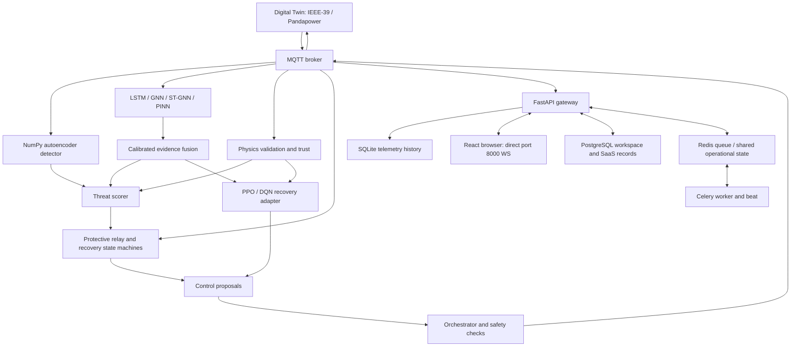
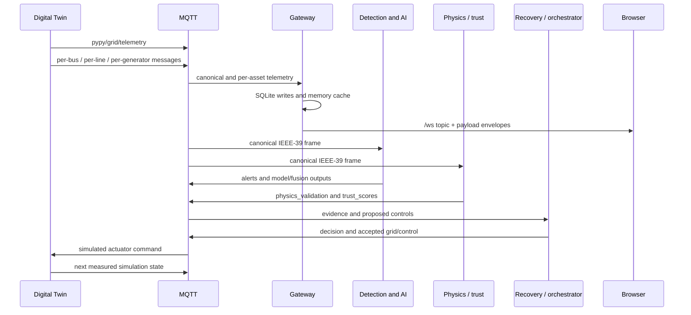
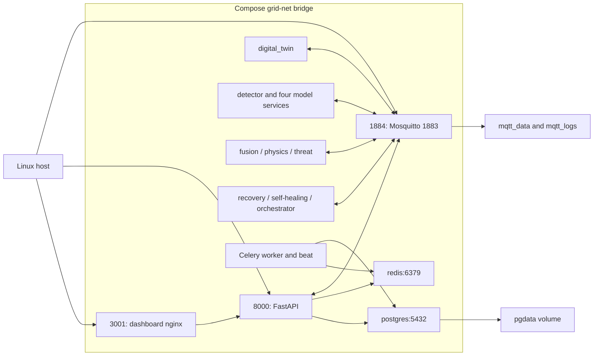
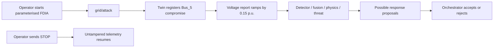
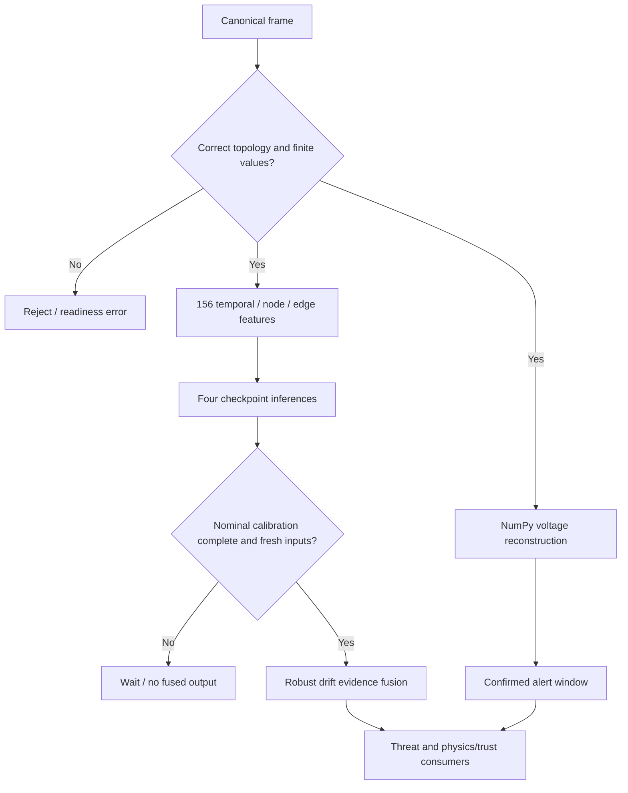
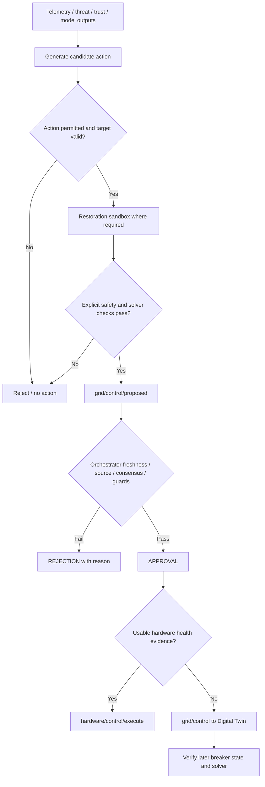
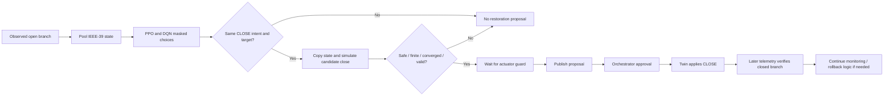

# PYPY — Smart Grid Cybersecurity
## Complete User and Technical Manual

**AI Cyber-Physical Immune System · Version 1.0 · 10 September 2026**

| Document information | Value |
|---|---|
| Purpose | Operation, supervisor demonstration, technical handover, thesis support, and maintenance |
| Intended readers | Supervisor, examiner, student demonstrator, developer, and future maintainer |
| Audited repository | `/home/demie/.gemini/antigravity/scratch/smart-grid-cybersecurity` |
| Repository HEAD | `5f00008a8ece9a13aaaa37d1ce5c91668b7e7b9e` |
| Package version | `11.9.0`, from `pyproject.toml` |
| Working tree | Contains pre-existing modified and untracked implementation files; HEAD alone does not reproduce this audit |
| Primary deployment | Root `docker-compose.yml`, 19 services, IEEE-39 simulation |
| Evidence date | 10 September 2026, Asia/Kuala_Lumpur; runtime UTC records include 9 September |
| Scope boundary | Local simulated grid and implemented supporting software; no claim of utility deployment |

## Contents

- [1. How to use this book and its evidence](#1-how-to-use-this-book-and-its-evidence)
- [2. Project introduction](#2-project-introduction)
- [3. The project concept as a story](#3-the-project-concept-as-a-story)
- [4. Implemented objectives and scope](#4-implemented-objectives-and-scope)
- [5. Actual system architecture](#5-actual-system-architecture)
- [6. Data flow and message contracts](#6-data-flow-and-message-contracts)
- [7. Software stack](#7-software-stack)
- [8. Directory structure and ownership boundaries](#8-directory-structure-and-ownership-boundaries)
- [9. Installation on Linux / Kali Linux](#9-installation-on-linux--kali-linux)
- [10. Starting PYPY and quick demo mode](#10-starting-pypy-and-quick-demo-mode)
- [11. Service reference and Docker architecture](#11-service-reference-and-docker-architecture)
- [12. Dashboard and UI user guide](#12-dashboard-and-ui-user-guide)
- [13. Normal operation and expected observations](#13-normal-operation-and-expected-observations)
- [14. Cyber attack simulation](#14-cyber-attack-simulation)
- [15. Cyber detection pipeline](#15-cyber-detection-pipeline)
- [16. AI/ML models and training status](#16-aiml-models-and-training-status)
- [17. Digital twin: meaning and limits](#17-digital-twin-meaning-and-limits)
- [18. Trust and validation](#18-trust-and-validation)
- [19. AI decision making and authority](#19-ai-decision-making-and-authority)
- [20. Self-healing and response](#20-self-healing-and-response)
- [21. Logging and forensics](#21-logging-and-forensics)
- [22. Reporting and generated results](#22-reporting-and-generated-results)
- [23. System health and readiness](#23-system-health-and-readiness)
- [24. Testing and validation](#24-testing-and-validation)
- [25. Troubleshooting guide](#25-troubleshooting-guide)
- [26. Safe shutdown](#26-safe-shutdown)
- [27. Demo preparation checklist](#27-demo-preparation-checklist)
- [28. Current limitations](#28-current-limitations)
- [29. Future maintenance and improvements](#29-future-maintenance-and-improvements)
- [30. Glossary](#30-glossary)
- [Appendix A. Operator command reference and verification scope](#appendix-a-operator-command-reference-and-verification-scope)
- [Appendix B. API use and storage boundaries](#appendix-b-api-use-and-storage-boundaries)
- [Appendix C. Research and legacy interpretation guide](#appendix-c-research-and-legacy-interpretation-guide)
- [Appendix D. Handover procedure](#appendix-d-handover-procedure)

## 1. How to use this book and its evidence

Read Chapters 2–6 to understand the project, Chapters 9–14 to operate it, Chapters 15–22 to explain the engineering, and Chapters 23–29 to maintain it. The appendices provide service, source, command, and interface references. The separate [demo script](PYPY_SUPERVISOR_DEMO_SCRIPT.md) is the concise speaking guide; this book is the technical reference behind it.

Implementation claims use the following evidence classes. **A** means source inspected; **B** means configuration inspected; **C** means current tests inspected or executed; **D** means fresh runtime observations. **E** means a historical document or generated report exists but its experiment was not repeated. **F** means experimental, legacy, inactive, or incomplete functionality. A class-A implementation can still be unreliable: existence and effectiveness are different questions.

The audit inventory covers 2,125 non-cache files and structural inspection of 646 Python files. It excludes Git internals, dependency trees, bytecode, PlatformIO environments, and audit output itself. The audit follows the active service entrypoints, message contracts, UI routes, data paths, model loaders, safety logic, and relevant tests in depth. It is not a claim that every research algorithm or every historical result was independently revalidated. Machine-readable inventories and fresh observations are in [audit evidence](audit_evidence/2026-09-10/).

The distinction matters because this repository contains several generations of PYPY. A file named `simulator.py`, a model checkpoint, a screenshot, and a Docker service are four different kinds of evidence. A checkpoint does not prove good accuracy; a dashboard label does not prove backend enforcement; a passing unit test does not prove a healthy broker.

**Reading rule:** use the current source and the root Compose file when old README text, thesis language, comments, or historical screenshots disagree. Avoid executing commands from `/home/demie`: that directory contains a different Compose file. The active project location was verified through the running gateway container's Compose working-directory label.

## 2. Project introduction

PYPY is a research and demonstration platform for examining how suspicious measurements and simulated grid disturbances interact with power-system monitoring and recovery. It maintains an electrical grid model, publishes measurements, analyses them through learning models and physics checks, produces response proposals, and evaluates selected proposals before applying simulated controls. Its web interface makes this chain visible to an operator.

A smart grid depends on both electricity and information. A control room needs measurements to know whether equipment is overloaded, whether voltage is acceptable, and whether a breaker is open. An attacker who changes those measurements may influence operational decisions even without directly damaging equipment. Conversely, a genuine electrical fault may produce unusual data without involving an attacker. PYPY explores both sides of this problem.

The local demonstration does not connect to a power utility. The starting system is the IEEE-39 benchmark represented through Pandapower. Bus voltages, power injections, branch flows, breaker states, and other fields are simulated. The software infrastructure—Docker, MQTT transport, HTTP APIs, browser rendering, model inference, database operations, and logging—is real software running on the demonstration computer.

AI is used because abnormal conditions can have temporal and topological patterns. A temporal classifier can compare sequences; a graph model can use relationships between buses and branches; a physics-informed model can provide diagnostic residuals. These are complementary signals. None is treated here as proof that an adversary has been identified. The active detector also uses a small NumPy autoencoder with online calibration, and deterministic rules remain central to scoring and safe response.

A cyber-physical approach asks two connected questions: “Does this information look abnormal?” and “Would the proposed action make electrical sense?” PYPY implements parts of both. Its most defensible contribution is the integration and observation of that pipeline, with explicit limits on model provenance and simulation realism.

**Evidence:** [digital twin](../core/digital_twin/main.py), [model runtime](../core/ai_runtime/model_service.py), [orchestrator](../core/orchestrator/ai_orchestrator.py), [Compose](../docker-compose.yml). These are A/B; fresh baseline and rehearsal files provide D.

## 3. The project concept as a story

Imagine an operator watching a simulated grid. Every second, the digital twin calculates a new electrical state. It reports the state over MQTT. The gateway forwards information to the browser, and several analysis services receive the same canonical telemetry.

Initially the system learns or collects its nominal reference. The autoencoder calibrates on 20 frames. LSTM and ST-GNN accumulate 20-frame windows. Fusion collects at least 20 nominal samples from each of its four model inputs. This is why starting an attack immediately after startup is a poor demonstration: some consumers do not yet have enough context.

Next, a controlled FDIA changes the reported voltage of Bus_5. In the audited rehearsal, the bias ramped to +0.15 p.u. over five sweeps. The electrical solver was not instructed to create a physical voltage fault. The telemetry had been altered after the simulated state was constructed. This distinction makes the experiment useful: one can observe a disagreement between a suspicious report and the broader system evidence.

The NumPy detector produced a critical `GRID_DEVIATION` on Bus_5. The threat score reached 100. Other services supplied fusion, physics, and trust information. Some isolation proposals reached the orchestrator. They were rejected because the required decision conditions were not met. Breakers remained closed. The rejection is an observable response outcome, not a failed requirement that every attack must trip a breaker.

The operator then stopped the simulation. Bus_5's reported voltage returned to approximately 1.002 p.u. This is the end of telemetry tampering; it is not proof of autonomous electrical restoration. Physical recovery is demonstrated as a separate breaker experiment, with its own proposal, validation, decision, control, and post-control state evidence.

The immune-system analogy is useful if used carefully: measurements are vital signs; detection is surveillance; validation is diagnosis; response selection is treatment planning; safe control is intervention; logs are records. Logs alone are not biological learning, and a threat score is not a medical-style probability of infection.

**Evidence:** [FDIA rehearsal](audit_evidence/2026-09-10/fdia_summary.json), [tampering implementation](../core/digital_twin/main.py), [detector](../core/ai_detection/detector.py).

## 4. Implemented objectives and scope

| Objective | What is implemented | Qualification |
|---|---|---|
| Represent a grid | Pandapower topology, load/generator state, branch states, repeated power-flow calculation | Simulation, not a measured utility twin |
| Distribute telemetry | Canonical and per-asset MQTT messages; WebSocket browser updates | Several schemas coexist |
| Introduce controlled attacks | FDIA, replay, DoS effects, sensor spoofing, breaker manipulation, scenario composition | Parameters and topology identifiers matter |
| Detect abnormal state | NumPy autoencoder, LSTM/GNN classifiers, ST-GNN forecast scores, PINN diagnostics | Anomaly detection is not reliable attack attribution |
| Validate evidence | KCL/KVL-derived checks, trust, impossible-state checks, freshness handling | Shared model assumptions limit independence |
| Propose recovery | PPO/DQN compatibility runtime and rule-based recovery modules | Policies are not newly trained IEEE-39 policies |
| Gate selected actions | Sandbox validation, orchestrator checks, voting/guards, duplicate suppression | Direct operator controls are a separate route |
| Explain operation | Ten-page control centre, incident feed, decision evidence, health signals | Some runtime fields do not map into UI cards |
| Retain evidence | SQLite telemetry, bounded event caches, Docker logs, research JSON/CSV outputs | Durability differs by store |
| Support research workflows | Datasets, trainers, evaluators, experiments, SaaS APIs | Not every workflow is a reliable live demo |

The thesis may call these elements an “immune system,” “trust layer,” or “self-healing intelligence.” The runtime names are more concrete: `ai_detection`, `ai_fusion`, `physics_validation`, `threat_scorer`, `recovery_policy`, `self_healing`, and `ai_orchestrator`. Use those names when answering implementation questions.

Do not claim that all research layers run as services. Adversarial training, transfer learning, the assistant daemon, the arena, old forecasting services, and hierarchical research consensus have code but are not separate services in the default Compose deployment. Some supporting classes are imported by active services; that does not make every research pipeline active.

## 5. Actual system architecture



Arrows here show logical exchange. Most runtime services actually communicate through MQTT rather than direct function calls across containers. The diagram deliberately separates SQLite time-series storage from PostgreSQL application records.

| Component | Input | Processing | Output and connections |
|---|---|---|---|
| Digital twin | Configuration, attack and control messages | Updates topology state; solves AC flow; applies telemetry tampering | MQTT telemetry and events |
| NumPy detector | 39 bus voltages | Reconstruction error, calibration, confirmation window | `grid/alerts`, readiness |
| Model services | Validated IEEE-39 frames | CPU PyTorch inference | Four `grid/ai/*` streams |
| Fusion | Four model scores and nominal-state context | Robust baseline drift calculation | `grid/ai/fusion` |
| Physics/trust | Telemetry and AI evidence | Electrical consistency, persistence, sensor trust | Validation, trust and filter streams |
| Threat scorer | Telemetry, alerts, fusion and trust | Weighted rules and optional known-attack context | Threat score and recommendations |
| Recovery policy | Full topology pooled into policy state | PPO/DQN decisions, intent consensus, sandbox | Policy evidence and selected proposals |
| Self-healing | Telemetry, events, threat/trust/configuration | Relay logic, state machines, containment/restoration helpers | Recovery state and proposals; some protective/rollback controls |
| Orchestrator | Proposals and cached subsystem evidence | Safety rules, freshness, consensus, cooldowns | Approval/rejection; accepted control |
| Gateway | MQTT and browser/API requests | Schema translation, caches, SQLite writes, API dispatch | WebSocket and HTTP |
| Dashboard | WebSocket state | Page composition and operator controls | Control/attack/config messages |
| Celery | Queued SaaS jobs and schedules | Job status/progress, simulation workflow, billing schedules | PostgreSQL records and tenant/run telemetry |

The default hardware path is simulation. The orchestrator can route to `hardware/control/execute` when appropriate device-health evidence exists; otherwise it publishes to `grid/control`. No hardware daemon is configured in the default 19-service stack. Do not describe this session as verified physical relay operation.

## 6. Data flow and message contracts



### 6.1 Canonical versus per-asset telemetry

`pypy/grid/telemetry` is the canonical active AI input. Its `state` contains `buses`, `lines`, and `breakers`; it also carries `grid_name`, `timestamp`, `solver_status`, and attack context. The IEEE-39 contract requires 39 buses and 46 branches: 35 lines and 11 transformers. Bus labels are `Bus_1` through `Bus_39`. Branch labels are `L_line_0` through `L_line_34` and `L_trafo_0` through `L_trafo_10`.

Per-asset topics use zero-based numeric bus IDs: `pypy/grid/bus/4/metrics` describes Bus_5. This off-by-one distinction is important when comparing a UI label to a database query. Branch IDs remain string identifiers. Generator topics use their generator indices. See [telemetry serializer](../core/digital_twin/telemetry.py).

The gateway subscribes to per-asset streams and writes their values to SQLite. It also translates per-asset state into legacy `grid/telemetry`, triggered on the final IEEE-39 bus update. The canonical frame and the translated frame are not interchangeable. The active runtime favours canonical IEEE-39 data, while compatibility consumers still exist.

Tampering is applied to the canonical telemetry object; per-asset AC messages are published separately from solver arrays. Consequently a tampered canonical bus voltage can differ from its per-asset stored measurement. That is a critical interpretation point for FDIA and historical queries, not proof that the database silently lost an attack. Capture canonical MQTT messages when demonstrating tampering.

### 6.2 Essential topic reference

| Topic | Producer / consumer | Meaning |
|---|---|---|
| `pypy/grid/telemetry` | Twin → analysis/gateway | Canonical full state |
| `pypy/grid/bus/+/metrics` | Twin → gateway | Bus voltage, angle and injections |
| `pypy/grid/line/+/flow` | Twin → gateway | Branch flow and loading |
| `pypy/grid/gen/+/status` | Twin → gateway | Generator status/output |
| `grid/telemetry` | Compatibility publisher/translator | Legacy full-state view |
| `grid/attack` | Operator → twin/detector | Attack lifecycle and parameters |
| `grid/config` | Operator/services → twin and consumers | Configuration, topology and modes |
| `grid/alerts` | Detector/protection → gateway/scorer | Abnormal-state alerts |
| `grid/events` | Several services → gateway | Narrative event records |
| `grid/ai/lstm`, `gnn`, `stgnn`, `pinn` | Model services → fusion | Raw model outputs under `grid/ai/` |
| `grid/ai/fusion` | Fusion → scorer/validation/recovery | Calibrated drift evidence |
| `grid/ai/status/+` | Runtime services → monitoring | Retained readiness messages |
| `grid/physics_validation` | Validation → downstream | Physics state and residuals |
| `grid/trust_scores` | Validation → downstream | Bus and branch trust percentages |
| `grid/adaptive_filter` | Validation → downstream | Filter status and confidence |
| `grid/threat` | Scorer → downstream | 0–100 score and recommendations |
| `grid/ai/recovery_policy` | Recovery policy → observers | Both policy decisions and sandbox |
| `grid/ai/recovery/ppo`, `grid/ai/recovery/dqn` | Recovery policy → observers | Individual policy choices |
| `grid/control/proposed` | Recovery/defence → orchestrator | Candidate actuator command |
| `grid/orchestrator/events` | Orchestrator → observers | APPROVAL / REJECTION and reason |
| `grid/control` | Operator/orchestrator/protection → twin | Simulated control command |
| `grid/l6_recovery` | Self-healing → observers | Recovery state-machine evidence |
| `pypy/{tenant_id}/{run_id}/telemetry` | Celery workflow → gateway | Separate tenant job stream; not canonical AI input |

### 6.3 Time and correlation

Most payload timestamps are Unix milliseconds. Internal timers often use seconds or monotonic time. Do not compare a seconds value directly against a milliseconds value. `telemetry_id`, `source_telemetry_id`, `experiment_id`, `scenario_id`, and `correlation_id` support traceability in newer code. Some proposals and legacy events still contain null or absent IDs. The FDIA rehearsal observed that limitation.

A proper causal chain is: a particular state, a proposal derived from it, an approval referring to the proposal, a control, and a later state showing the change. Mere proximity in the event feed is weaker evidence. Retained readiness can be old; compare its timestamp and fresh message flow before treating it as readiness.

## 7. Software stack

| Technology | Purpose | Relevant source/configuration | Status |
|---|---|---|---|
| Python | Simulation, inference, APIs, orchestration | `core/`, `pyproject.toml` | Active |
| Docker / Compose | Service packaging and dependency startup | Root Compose and service Dockerfiles | Active, 19 services |
| Pandapower | AC power-flow network and solutions | `core/digital_twin/solver.py`, grid loaders | Active |
| NumPy / SciPy / pandas | Numeric processing and tabular data | Core requirements and simulator/models | Active |
| PyTorch | Four model services and PPO/DQN inference | `core/requirements-ai.txt` | Active CPU inference |
| scikit-learn | Training/evaluation metrics and research tools | LSTM/GNN/PINN evaluators | Offline/research; not in core runtime requirements |
| Paho MQTT | Publish/subscribe client | `core/mqtt_compat.py`, runtime entrypoints | Active |
| Eclipse Mosquitto | Message broker | `mosquitto.conf`, Compose | Active |
| FastAPI / Uvicorn / Pydantic | HTTP and WebSocket gateway | `core/gateway/main.py` | Active; no Flask entrypoint in selected stack |
| SQLite | Per-asset telemetry history | `core/gateway/database.py` | Active |
| PostgreSQL / SQLAlchemy | Users, tenants, jobs, experiments, audit tables | `core/services/auth/` | Active configuration; specific workflows require separate validation |
| Redis | Celery transport and operational state | `core/workers/`, service helpers | Active |
| Celery worker / beat | Background jobs and billing schedules | `core/workers/simulation/tasks.py`, billing tasks | Processes active; job execution has caveats |
| React / TypeScript / Vite | Control-centre interface | `dashboard/package.json`, `src/` | Active |
| Tailwind CSS / Lucide / Recharts | Styling, icons and chart components | Dashboard dependencies | Implemented; not every legacy chart is reachable |
| nginx | Static frontend and gateway proxy | `dashboard/nginx.conf` | Active on host 3001 |
| pytest | Automated validation | `tests/`, `pyproject.toml` | 874 collected, 609 unit tests passed |
| Playwright / Chromium | Browser audit | Fresh browser evidence | Ten routes verified; system Python driver needed alternative installed Node package |
| Grafana | Dashboard JSON artifact | `monitoring/grafana/dashboards/pypy_operations.json` | Not an active default service |
| InfluxDB | No active implementation found in selected runtime | No Compose service or live storage integration found | Do not claim active use |

Runtime Dockerfiles use Python 3.10. The audited host uses Python 3.13.14 with an already provisioned environment. These are not equivalent installation paths: old NumPy/SciPy pins can make a fresh Python 3.13 install difficult. Prefer the supported Docker images for the demo.

## 8. Directory structure and ownership boundaries

| Directory/file | What to look for | Maintenance interpretation |
|---|---|---|
| `docker-compose.yml` | Default services, ports, health checks | Authoritative demo deployment |
| `core/digital_twin/` | Topology, solver, state, telemetry and attacks | Primary simulated-grid implementation |
| `core/ai_detection/` | Active NumPy detector | Use top-level `detector.py`; `src/` is older |
| `core/ai_runtime/` | Feature contract, serving, readiness and fusion | Four active checkpoint services |
| `core/lstm/`, `core/gnn/`, `core/pinn/` | Model definitions, checkpoints, trainers/evaluators | Runtime model architecture plus offline experiments |
| `core/physics_validation/` | KCL/KVL, trust, filtering | Deterministic physics and confidence layer |
| `core/threat_engine/` | Scoring and response recommendations | Includes experiment-aware rules |
| `core/self_healing/` | Relay, FLISR, recovery, sandbox and RL | Multiple generations coexist |
| `core/orchestrator/` | Proposal evaluation and authority | Inspect actual forwarding path |
| `core/gateway/` | HTTP routes, MQTT, caches, SQLite | Main API service |
| `core/services/`, `core/workers/` | SaaS persistence and asynchronous jobs | Copied into gateway image |
| Root `services/`, `workers/` | Earlier parallel service layout | Do not assume these are the image's runtime copies |
| `dashboard/src/` | Active React UI and older components | `PypyControlCenter.tsx` is the current shell |
| `core/dataset_generator/`, `core/data_collector/` | Synthetic dataset creation and stored CSV | No dataset required for already trained inference |
| `checkpoints/` | Recovery and adversarial model artifacts | Two root recovery checkpoints are copied by recovery image |
| `core/adversarial/`, `arena/`, `transfer/`, `analytics/`, `consensus/` | Research environments and analysis | Not separate default services |
| `core/hardware/`, `hardware/` | Virtual and physical device integration code/firmware | Hardware not validated by this software-only demo |
| `core/assistant/` | Assistant/cognition/voice integrations | Not launched by default Compose |
| `tests/` | Unit, physics, cyber, integration, research and browser tests | Some fixtures deliberately use legacy nine-bus state |
| `evaluation/`, `research/`, `training_logs/` | Historical metrics, methodology and training outputs | Treat as recorded evidence, not fresh results |
| `docs/`, `thesis_assets/` | Manuals, screenshots, figures and thesis material | This package belongs here |
| `k8s/`, `nginx/`, production Compose | Alternative deployment material | Not selected for tomorrow's demonstration |
| `logs/`, `backups/` | Persisted logs and backup artifacts | Inspect timestamps; protect evidence before resets |

The repository is not a clean installation template. It has accumulated working-tree changes, generated outputs, alternative layouts, and large checkpoints. For handover, preserve a source snapshot together with environment and checkpoint manifests. Do not remove “unused” modules just because they are absent from Compose; tests and research scripts may still import them.

## 9. Installation on Linux / Kali Linux

### 9.1 Recommended installation boundary

Use a Linux host with Docker Engine and the Docker Compose plugin already installed and accessible. This manual verifies project commands, not a distribution-specific Docker installation transaction. Kali release, package repositories, and administrative policy can differ; the repository does not contain a maintained Kali bootstrap installer. Obtain Docker through the host's approved installation method, then verify the commands below.

```bash
cd /home/demie/.gemini/antigravity/scratch/smart-grid-cybersecurity
docker --version
docker compose version
docker info
docker compose config --quiet
```

`docker info` must reach the daemon. A permission error concerns daemon access, not a missing Python module. A stopped daemon must be started through the host service manager before Compose can work. Membership changes for Docker access may require a new login session. Do not confuse an API service “healthy” result with host Docker availability.

The host needs enough storage for image layers, PyTorch, datasets, and checkpoints. No measured minimum CPU/RAM specification is established by this audit. Check available memory and disk before building, particularly on a virtual machine. A successful existing run is evidence for this machine, not a hardware specification for every machine.

### 9.2 Obtain a reproducible project snapshot

Use the actual working tree, not only the recorded commit. Existing modifications affect models, feature conversion, the simulator, safety code, Compose, and UI. Record `git status --short`, the commit ID, and checkpoint checksums with the handover copy. Never reset or clean the current tree to make it resemble the commit; that would remove audited functionality.

Check the six active checkpoints:

```bash
ls -lh core/lstm/trained_lstm_model.pt core/gnn/trained_gnn_model.pt \
  core/gnn/trained_stgnn_model.pt core/pinn/trained_pinn_model.pt \
  checkpoints/ppo_self_healing.pt checkpoints/dqn_self_healing.pt
```

Inference needs these checkpoint files. It does not require downloading or regenerating the large training CSVs. A missing checkpoint makes the associated model loader fail; there is no documented auto-download recovery in the active serving code.

### 9.3 Configuration

Default Compose supplies the database connection, Redis URL, MQTT host/port, component names, and telemetry topic. It can run without copying `.env.production`. The example and production templates contain broader SaaS settings; copying them blindly is not a required demo step.

| Variable | Role | Demo interpretation |
|---|---|---|
| `MQTT_BROKER` | Broker hostname | `mqtt` inside Compose; `localhost` for host tools |
| `MQTT_PORT` | Broker port | 1883 inside network; 1884 from host |
| `TELEMETRY_TOPIC` | Active full-state input | `pypy/grid/telemetry` |
| `GRID_BUS_COUNT` | NumPy detector vector size | 39 in default deployment |
| `MODEL_COMPONENT` | Shared model service selection | lstm, gnn, stgnn, pinn; separate fusion/recovery/trust processes |
| `DATABASE_URL` | SQLAlchemy application store | PostgreSQL in Compose |
| `REDIS_URL` | Worker broker / Redis connection | `redis://redis:6379/0` in Compose |
| `DEFENCE_EVALUATION_MODE` | Detector/scorer experiment context | Default `experiment_aware`; `blind` changes these consumers |
| `FUSION_CALIBRATION_SAMPLES` | Nominal samples per component | 20 in Compose |
| `FUSION_FRESHNESS_SECONDS` | Fusion input age bound | Code default 5 seconds |
| `LOG_LEVEL` | Log verbosity | INFO in normal operation |
| `ALLOWED_ORIGINS` | HTTP CORS origins | Code includes localhost 3001; affects development clients |
| `TELEMETRY_HEARTBEAT_PATH` | Twin heartbeat file | Default `/tmp/pypy_telemetry_heartbeat` |
| `PYTHONPATH` | Python import layout | Service-specific `/app` configuration |

Do not publish connection secrets in slides. The checked-in deployment uses development-style credentials and anonymous broker access. This is suitable evidence of local configuration, not evidence of production security. Do not put this control interface on a public network as part of a presentation.

### 9.4 Build and storage preparation

```bash
docker compose build
docker compose up -d
```

The build instructions are present and were inspected. Existing images were used for the live audit; a complete clean-image build and fresh dependency download were not repeated. The frontend production build was executed successfully. Build/network failures should therefore be diagnosed separately from runtime failures.

PostgreSQL uses the named volume `pgdata`; MQTT has `mqtt_data` and `mqtt_logs`. However, `mosquitto.conf` sets `persistence false`, so mounted broker data does not establish durable retained-message/session storage. Gateway startup calls SQLAlchemy `init_db()`, creates tables, attempts additive columns, and seeds scenario templates when empty. This is initialization logic, not a versioned migration system. A live gateway may have survived a failed database initialization because startup catches database errors; inspect logs when restoring a previously unavailable database.

The SQLite telemetry file lives at `/app/data/telemetry.db` inside the gateway container. The default Compose gateway does not mount that directory. A normal stop/start preserves the existing container's writable layer; removing or recreating the container can lose this telemetry history. Export evidence before rebuild/recreation.

### 9.5 Optional native development

Docker is the minimum reliable demo path. For source development, use Python 3.10 compatible with the project's pins, create an isolated environment, and install the repository requirements. These commands are supported by the files but were not executed as a fresh installation during this audit:

```bash
python3.10 -m venv .venv
. .venv/bin/activate
python -m pip install -r core/requirements.txt -r core/requirements-ai.txt
python -m pip install -e .
```

`pytest`, scikit-learn and other research dependencies may need provisioning for offline tests/trainers; they are not all declared in the minimal runtime requirements. Avoid substituting host Python 3.13 for 3.10 without reviewing numerical dependency compatibility. For frontend development, `npm --prefix dashboard install` and `npm --prefix dashboard run dev` are supported package-script operations; the production demo uses the bundle on port 3001. The active App.tsx connects directly to the current hostname on port 8000 for `/ws`; GridDiagram also fetches topology directly from port 8000. Nginx defines proxy routes, but their presence does not mean these active requests use them. Both ports must be reachable from the browser.

## 10. Starting PYPY and quick demo mode

### 10.1 Fastest path on the audited machine

```bash
cd /home/demie/.gemini/antigravity/scratch/smart-grid-cybersecurity
docker compose up -d
docker compose ps
curl --max-time 10 -fsS http://localhost:8000/api/health
```

Open `http://localhost:3001/#/overview`. The API response should include `mqtt_connected: true`. Confirm all 19 services are healthy, then inspect a fresh canonical frame:

```bash
docker exec smart_grid_mqtt mosquitto_sub -t pypy/grid/telemetry -C 1 -W 10
```

Allow at least a minute for startup, sequence windows, and fusion calibration; readiness messages are the actual gate, not elapsed time alone. Confirm IEEE-39, solver convergence, no active attack, and expected breaker state. The running system may contain an earlier experiment's state, so inspect before applying a reset.

### 10.2 When only infrastructure is stopped

This exact recovery resolved the initial audit blocker:

```bash
docker compose up -d postgres redis mqtt
```

The AI services were restarting because their broker could not resolve. Restarting their dependencies restored the full stack without source edits. If consumers do not recover after infrastructure becomes healthy, inspect their recent logs, then restart only affected services. Do not repeatedly rebuild images to solve a stopped broker.

### 10.3 State reset for a new rehearsal

First save any evidence you need. Stop the attack, then reset the simulator only when the current experiment may be discarded:

```bash
docker exec smart_grid_mqtt mosquitto_pub -t grid/attack -m '{"action":"STOP"}'
docker exec smart_grid_mqtt mosquitto_pub -t grid/control -m '{"command":"RESET_ALARMS","target":"SYSTEM"}'
```

Despite its name, `RESET_ALARMS` with target `SYSTEM` resets much more than visible alerts: breaker state, active attacks, transient/thermal histories, lockouts, load-shed factors, generator availability/setpoints, and island-frequency state. It is an operator reset and must never be described as autonomous recovery.

### 10.4 Acceptance criteria

A demo-ready startup has healthy containers, fresh canonical telemetry, converged power flow, no unexpected active attack, model outputs, calibrated fusion, physics/trust output, and a functioning browser connection. A process health check alone is insufficient. Some health checks only look for a process, and `/api/health` can report `status: healthy` even if `mqtt_connected` is false.

## 11. Service reference and Docker architecture

All service names below are from the root Compose configuration. “Internal” means no separate published host port.

| Service / container suffix (`smart_grid_…`) | Role | Host port | Main dependencies | Health check |
|---|---|---|---|---|
| `postgres` | Application database | 5432 | Named volume | `pg_isready` |
| `redis` | Queue/operational store | 6379 | None | `redis-cli ping` |
| `mqtt` | Message transport | 1884→1883; 9001 | Config/volumes | Subscribe to broker `$SYS` |
| `gateway` | FastAPI/WS and persistence | 8000 | postgres, redis, mqtt | HTTP `/api/health` |
| `celery_worker` | Simulation jobs | Internal | redis, postgres | Celery inspect ping |
| `celery_beat` | Billing schedule process | Internal | redis, postgres | Process lookup |
| `digital_twin` | Live simulated grid | Internal | mqtt | Heartbeat age <10 s |
| `ai_detection` | NumPy detector | Internal | mqtt, healthy twin | Ready heartbeat <20 s |
| `ai_lstm` | Temporal classifier | Internal | mqtt, twin | Runtime heartbeat script |
| `ai_gnn` | Graph classifier | Internal | mqtt, twin | Runtime heartbeat script |
| `ai_stgnn` | Temporal graph risk | Internal | mqtt, twin | Runtime heartbeat script |
| `ai_pinn` | Physics-informed diagnostics | Internal | mqtt, twin | Runtime heartbeat script |
| `ai_fusion` | Model evidence fusion | Internal | Four healthy model services | Runtime heartbeat script |
| `physics_validation` | Rules and trust | Internal | mqtt, twin | Runtime heartbeat script |
| `recovery_policy` | PPO/DQN proposal adapter | Internal | fusion, physics | Runtime heartbeat script |
| `threat_scorer` | Threat and recommendations | Internal | detector, fusion, physics, mqtt | Process lookup |
| `self_healing` | Relay/recovery helpers | Internal | threat scorer, mqtt | Process lookup |
| `ai_orchestrator` | Decision gate | Internal | self-healing, mqtt | Process lookup |
| `dashboard` | nginx + React bundle | 3001→80 | gateway | Local HTTP fetch |



`depends_on` controls Compose startup conditions; it does not guarantee permanent dependency health after a host restart. The observed outage is an example: application services had restart policies while the three infrastructure services were stopped. Check the entire graph after restarting the machine.

## 12. Dashboard and UI user guide

The active UI is [PypyControlCenter.tsx](../dashboard/src/components/PypyControlCenter.tsx), returned by [App.tsx](../dashboard/src/App.tsx). An older operational layout remains below an unconditional return and is not rendered. Do not follow old screenshots for the legacy analytics, cloud operations, scenario marketplace, or assistant pages when demonstrating this control centre.

All ten routes were loaded in a headless Chromium audit with no page-level JavaScript errors. This verifies rendering, not every button's semantic correctness. Fresh screenshot and page-text evidence is stored with the audit.

| Page / hash route | What appears | Actions | Interpretation |
|---|---|---|---|
| Overview `#/overview` | Grid status, load, threat, alerts, model count, topology, incidents, recommendation and decision path | Recovery link and topology controls | Introduce the whole platform |
| Live Grid `#/grid` | Voltage range, average supplied frequency, current, breaker count, full topology | Zoom/pan/fit, inspect and supported breaker controls | Show the simulated electrical system |
| Cyber Detection `#/detection` | Threat meter, affected assets, model cards, alert/event timeline | Primarily observation | Distinguish named scenario from detected anomaly |
| AI Decision `#/decision` | Proposal path, consensus field, final decision, fusion, physics and trust | Primarily observation | Explain acceptance/rejection evidence |
| Self-Healing `#/recovery` | FLISR mode/state, isolation/reroute counts, safety card, latest control | “Simulate first”; “Execute recommended action” conditionally enabled | Read with raw recovery evidence; card mapping is incomplete |
| Attack Simulation `#/simulation` | Five attack choices, target input, scenario status and feed | “Start simulation”; “Stop scenario” | Sends `grid/attack` through WebSocket |
| Logs & Forensics `#/forensics` | Timestamped alerts/events | Search records; ALL/ALERT/EVENT filter | Bounded browser-visible evidence, not complete archival storage |
| System Health `#/health` | WebSocket, message rate, signal presence, model cards | Observation | Signal receipt is not a fresh Docker health check |
| Reports `#/reports` | Live situation summary and evidence availability | No file-export action in this page | Operational summary, not thesis report generation |
| Settings `#/settings` | Compact density, interface motion, grid selector | Toggle browser preferences; select IEEE14/39/57/118 | Grid selection affects shared twin; keep IEEE39 for AI demo |

The Attack Simulation page operates the same shared simulated twin watched by other clients. Its simulation label does not create a separate disposable preview environment.

### 12.1 Interpreting topology

A bus is a network node; a branch connects nodes; a breaker state describes whether the simulated connection is available. A coloured asset is a UI representation of supplied telemetry and status logic. Read numerical values and explicit state alongside colour. The overview's “Stable/Degraded/Critical” logic uses active attack, open breakers and voltage thresholds; it is not identical to the physics service's state classifier.

The grid visualisation receives `flisr_*` and attack-status properties. Those are separate from the canonical voltage/flow fields. An absent recovery overlay is not proof that inference stopped. Confirm the source topic when two panels disagree.

The Overview load card expects `load_mw` or `p_load_mw`; canonical buses supply signed `P_mw` instead. The screenshot showed Active power load as Unavailable. Do not substitute signed injections and call their sum demand without defining that calculation.

GridDiagram reads branch `loading_percent`, while canonical branch telemetry supplies `capacity_pct`. The final browser check displayed 0% branch labels despite nonzero current data. Use raw canonical loading evidence rather than the topology percentage labels for quantitative claims. Topology is fetched asynchronously; a very early screenshot can show buses before branch connections arrive. A seven-second follow-up displayed connections and no failed browser requests.

### 12.2 Known UI-to-backend gaps

The FDIA form sends only `config.target`. The backend defaults bias to zero and scale to one, so that form's default FDIA has no numerical tampering. The parameterised terminal command in Chapter 14 is the verified workaround. Replay requires an already recorded buffer; the current form does not supply recording controls. A breaker attack must target a real branch, not the default `Bus_5`.

The recovery service publishes its status as `recovery_policy` and its policy evidence under `grid/ai/recovery_policy` and `grid/ai/recovery/{ppo,dqn}`. The current model cards look for `ppo` and `dqn` status entries or older `preRl` data. Both policies may run while the UI says “Unavailable.” This happened in the baseline page audit. Use raw MQTT evidence rather than claim that a missing card means a missing model.

The safety card reads `sandbox.passed` or `safety_passed`; active sandbox evidence exposes fields such as `is_safe` and `overall_safe`. The page can therefore show “Awaiting evidence” despite a backend decision. The “Execute recommended action” button is not required for this demo. Its path is a direct operator `grid/control` request, not a fresh orchestrator proposal transaction.

The Settings topology selector offers several Pandapower networks, but the active learned feature converter requires IEEE-39. Switching topology during the AI demonstration will invalidate that contract. The safest presentation keeps the selected grid unchanged.

## 13. Normal operation and expected observations

The twin runs at a nominal one-second sweep interval. It maintains load/generator settings and breaker state, obtains a power-flow solution, builds telemetry, applies any active tampering, and publishes. The observed baseline had 39 buses, 46 branches, all breakers closed, no active attack, and solver status `converged` with two iterations. Exact voltages and timing vary with simulation state and scheduling.

The NumPy autoencoder first calibrates, then evaluates maximum bus reconstruction error. Normal samples may update its weights and threshold. The four checkpoint services perform inference independently. Fusion gathers a nominal reference and maps deviations from it to a combined drift score. PPO and DQN still perform inference under nominal conditions, but the permitted action set reduces to `NO_ACTION` when there are no open branches.

A normal operational outcome can therefore be quiet: no new proposal, no approval, no breaker movement. Do not trigger extra actions merely to make the interface look busy. The baseline recovery record showed both policies choosing `NO_ACTION`, consensus false, and sandbox null. That is an expected nominal decision, not a policy failure.

| Observation | Fresh audit value/example | What it proves |
|---|---|---|
| Gateway health | `mqtt_connected: true` | Gateway broker connection |
| Solver | Converged, two iterations | Current power-flow solution succeeded |
| Physics | NORMAL; score 0; KCL/KVL errors 0 in captured frame | Rules found no current mismatch in that frame |
| Fusion | Approximately 0.03 in baseline snapshot | Small calibrated drift at that moment |
| Grid confidence | Approximately 98.54% in captured physics payload | Derived operational index, not empirical accuracy |
| Threat | Around 30, MEDIUM | Scorer includes electrical margins/rules; nominal does not imply zero |
| Policies | NO_ACTION, no open branch | Normal action mask behaviour |
| Browser | Connected and updating | UI receives service data |

Expected log families include MQTT connection/subscription messages, detector calibration completion, model readiness, and periodic orchestration summaries. Historical error lines remain in Docker logs after a recovery. Use `--since` or timestamps to distinguish the current run from the earlier broker outage.

## 14. Cyber attack simulation

### 14.1 Active twin attack types

| Attack | Actual mechanism | Target | Symptom | Detection/response interpretation |
|---|---|---|---|---|
| FDIA | Bias/scale reported bus voltage or line current; five-sweep ramp | `Bus_n` or existing branch | Numeric drift with attack metadata | Autoencoder/AI/physics may flag mismatch; response is gated |
| REPLAY | Returns copied historical frames with current timestamp | Full recorded frame | Apparently old state repeated | Needs replay buffer; not guaranteed separable from normal data |
| DOS | After two sweeps, zeros selected telemetry and sets `COMM_LOSS` for supported objects | Bus/line/breaker | Missing/zeroed measurements | Simulated communication-loss effect, not actual packet flooding |
| SENSOR_SPOOFING | Random noise, accumulated drift, optional high-frequency oscillation | Bus or line | Noisy/drifting reading | Detection depends on configured magnitude and persistence |
| BREAKER_MANIPULATION | Forces supported breaker state; can schedule re-trips | Existing branch ID | Actual simulated topology changes | Separate physical outage/recovery experiment |
| SCENARIO | Scheduled/conditional composition of these primitives | Scenario-defined assets | Multiple phases | Several canned scenarios retain nine-bus branch IDs; not a reliable IEEE-39 default demo |

All six rows are in [the active twin](../core/digital_twin/main.py); SCENARIO is orchestration, not a sixth independent measurement-tampering algorithm. START/STOP and scenario/recording handlers are source-verified. Not every parameter combination was exercised live.

### 14.2 Other implemented attack-related code

The older `core/attack_simulator/src/attack_engine.py` contains an FDIA helper and an unauthorized-trip payload helper using older keys such as `voltage` and `breaker`; it is not the active twin attack receiver. The adversarial research environments implement FDIA, replay, DoS, line trips, stealth optimisation, partial observation, reconnaissance and attack sequencing. Transfer/cutline/islanding studies build on those primitives. These are research algorithms and environments, not additional choices in the ten-page UI.

Hardware attack modules model or route USB/HID, rogue-device, telemetry corruption, relay and sensor fault events. Their existence and unit tests do not demonstrate a physical BadUSB attack in the current stack. The default deployment has no corresponding hardware/attacker service. The source inventory records the individual modules for future work; this manual does not conflate them with the live simulated attack catalogue.

### 14.3 Recommended primary attack: parameterised Bus_5 FDIA

Use the following exact supported command after the nominal readiness checks:

```bash
docker exec smart_grid_mqtt mosquitto_pub -t grid/attack -m '{"action":"START","type":"FDIA","config":{"target":"Bus_5","bias":0.15,"scale":1.0}}'
```

Watch `#/simulation`, `#/detection`, `#/decision`, and `#/forensics`. Allow approximately 20–25 seconds to observe the ramp and confirmation. Then stop:

```bash
docker exec smart_grid_mqtt mosquitto_pub -t grid/attack -m '{"action":"STOP"}'
```

In the rehearsal, voltage rose from approximately 1.002 to 1.152 p.u.; a critical `GRID_DEVIATION` named Bus_5; threat reached 100; isolation proposals were rejected; no breaker opened. After STOP, voltage returned near baseline. This is the safest reliable primary scenario because it is simple, bounded, avoids deliberately changing electrical topology, and has a direct stop command.

Do not promise the alert label `TARGETED_FDIA`: the implemented classification heuristic produced `GRID_DEVIATION` for this injection. The attack generator knows its own type; detector output is separate evidence. The default scorer is also experiment-aware and receives attack context, so its fast score increase is not evidence of blind detection accuracy.

### 14.4 Optional separate physical response

A single `BREAKER_MANIPULATION` on `L_line_0`, stopped after observing the OPEN state, is a separate physical recovery demonstration. Use the verified outcome recorded in the [demo script](PYPY_SUPERVISOR_DEMO_SCRIPT.md) and [breaker evidence](audit_evidence/2026-09-10/breaker_summary.json). Do not extend to multi-line attacks during a short presentation merely because research scripts support them. Persistent breaker manipulation can re-trip a recently closed branch; stopping the attacker makes the recovery observation easier to interpret.



## 15. Cyber detection pipeline

### 15.1 NumPy autoencoder

The active detector consumes `Bus_1`…`Bus_39` `voltage_pu` values, validates finiteness, and reconstructs the vector through a tanh hidden layer. It has 39 inputs, 16 hidden units by default, and 39 outputs. Weights are initialised with seed 42; this detector calibrates online rather than loading one of the PyTorch checkpoints.

Twenty calibration frames receive ten training steps each. The initial threshold is 0.003; on completion it is at least 0.003 or 2.5 times the final calibration maximum-error value. During subsequent normal adaptation, a longer loss history can update the threshold with a floor of 0.001. At inference the anomaly score is the **maximum squared reconstruction error across buses**, preventing a single-bus deviation being averaged away among 38 nominal buses.

Normal confirmation uses two anomalous entries in a three-frame window. Known-attack mode uses five in six, with longer alert suppression. The code's older comment suggests the opposite, so use the actual assigned values. Duplicate alert cooldown is normally 12 seconds and 20 seconds under known attack. Severity depends on the ratio to threshold: at least eight is CRITICAL, at least three HIGH, otherwise WARNING.

The suspect bus is the maximum reconstruction-error location. Alert type is selected from spread/mean/max heuristics: `TARGETED_FDIA`, `PHYSICAL_FAULT`, `SENSOR_ANOMALY`, or `GRID_DEVIATION`. These labels are rule-derived descriptions of an error pattern, not a validated adversary identity classifier.

There is an observed edge case: confirmation can remain true from earlier window entries even when the latest sample is normal. After STOP, this rehearsal produced one warning naming Bus_10 with rounded loss zero. Preserve this limitation in an examiner answer; do not silently present every alert as a true positive.

### 15.2 Learned-model features

[features.py](../core/ai_runtime/features.py) enforces IEEE-39, finite values, the expected bus/branch counts, and convergence when solver status is supplied. Temporal input is 156 features in block order: all P values, all Q values, all voltage values, then all angles. Graph input is 39×4 node features: P/100, Q/100, voltage and angle. Edge input is 46×5: P/100, Q/100, loading/100, closed-line indicator, closed-transformer indicator. Branches are in numeric line-then-transformer order.

These contracts must match training. A model file loading successfully is not sufficient if feature order or units changed. Missing/non-finite/wrong-topology frames should be treated as invalid, not filled with arbitrary values to make a model run.

### 15.3 Calibrated fusion

Four scalar streams enter fusion: LSTM anomaly score, GNN anomaly score, ST-GNN maximum future node risk, and PINN physics loss. During nominal, converged, all-breakers-closed operation, each gets a reference buffer. At least 20 samples per component are required. The buffer retains up to 200 samples.

For each component, fusion computes the absolute deviation from median divided by a robust scale: the maximum of 1.4826×MAD, 1% of absolute median, and 0.000001. It maps that deviation to `1 - exp(-z/3)`. Weights are LSTM 0.30, GNN 0.25, ST-GNN 0.20, PINN 0.25. `confidence` is an agreement index based on the standard deviation of component evidence, not a measured probability of correct classification.

Inputs older than five seconds are rejected by default. If supplied source telemetry IDs disagree, no fused result is emitted. ID absence remains a weaker case because absent IDs are discarded in that comparison. Nominal-context collection is another reason not to describe the full platform as completely blind merely by changing detector/scorer mode.



## 16. AI/ML models and training status

| Model | Input / output | Checkpoint | Where invoked | Status and qualification |
|---|---|---|---|---|
| NumPy autoencoder | 39 voltages → reconstruction error | None; online weights | `core/ai_detection/detector.py` | ACTIVE; calibration on startup |
| LSTM | 20×156 sequence → eight-class probabilities | `core/lstm/trained_lstm_model.pt` | `IEEE39ModelRuntime` | ACTIVE inference; trainer exists |
| GNN | 39×4 nodes, 46×5 edges → class and node/edge risk | `core/gnn/trained_gnn_model.pt` | Same runtime | ACTIVE; topology fixed to IEEE-39 |
| ST-GNN | 20 graph frames → future node/edge risk | `core/gnn/trained_stgnn_model.pt` | Same runtime | ACTIVE; five-step forecast horizon reported |
| PINN autoencoder | 156-vector → reconstruction and physical outputs/loss | `core/pinn/trained_pinn_model.pt` | Same runtime | ACTIVE diagnostic; not a safety certificate |
| PPO | 72-element pooled state → masked action scores | `checkpoints/ppo_self_healing.pt` | `recovery_policy_service.py` | ACTIVE compatibility inference; no verified native IEEE-39 retraining |
| DQN | Same state → Q-values and selected action | `checkpoints/dqn_self_healing.pt` | Same recovery service | ACTIVE compatibility inference; file/runtime calls it DQN |
| Forecast LSTM/PINN variants | Legacy bus/threat forecasts | `core/ai_prediction/models/*.pt` | Offline or optional prediction engines | LEGACY / NOT USED in default demo |
| Pathogen/immune policies | Research attack/defence environment observations | `checkpoints/ppo_pathogen*`, `ppo_immune*`, others | Adversarial trainers/evaluators | EXPERIMENTAL / research |
| VAE immune memory | Encoded research memory | `core/adversarial/vae_immune_memory.pt` | Adversarial memory code | EXPERIMENTAL; not equivalent to live event cache |
| Transfer/league policies | Research multi-grid/self-play observations | `checkpoints/league/` and research checkpoints | Research scripts | TRAINING / EXPERIMENTAL |

The LSTM classifier instantiated at runtime has hidden size 64, two layers, dropout 0.2 and eight classes. The class order is NORMAL, N1_LINE, N1_GENERATOR, N2, VOLTAGE_INSTABILITY, FDIA, REPLAY and DOS. GNN uses the same eight classes and hidden dimension 128. ST-GNN uses hidden dimension 64 and a 20-frame sequence. PINN uses a 156-input, 64-hidden autoencoder architecture. These dimensions come from the actual loader, not thesis diagrams.

### 16.1 Training data and evaluation

The repository includes `core/data_collector/data/ieee39_telemetry_dataset.csv`, other collected/synthetic telemetry files, a dataset generator, and training/evaluation scripts. The generator can accept a seed, output path, valid-target count and start timestamp. Dataset presence does not establish real-grid provenance: this is primarily simulation-generated benchmark data.

LSTM and ST-GNN trainers now reference chronological partitions and window-span helpers in `core/ai_training/temporal_split.py`. This matters because overlapping windows can leak near-identical frames between training and test sets. Historical evaluation files include corrected/uncorrected analyses and raw/postprocessed GNN results. Do not select the highest number without identifying the split, checkpoint, label definitions and postprocessing.

The historical corrected LSTM report includes 0.875 accuracy, but its confusion matrix shows a serious normal/replay distinction problem. It is **E**, not a fresh accuracy result from this audit. This audit verified runtime loading/inference, collected current tests, and rehearsed limited scenarios; it did not retrain models or repeat all held-out evaluations.

### 16.2 Recovery policy provenance

The encoder pools all 39 buses and 46 branches into nine bins, preserving the legacy 72-dimensional checkpoint interface. The result explicitly reports `compatibility_adapter: true` and `retrained_on_ieee39: false`. Native IEEE-39 training episodes and training seed are not established by checkpoint presence. Avoid the statement “I trained PPO on IEEE-39” unless separate provenance proves it.

PPO actor scores and DQN Q-values are not interchangeable calibrated probabilities. Consensus concerns actuator intent and target. The policies may choose differently named actions that both map to CLOSE. With no open branches, only NO_ACTION is allowed. With open branches, the allowed action IDs are 0, 2, 8 and 9; the adapter selects a candidate open branch using loading and validates any proposed restoration.

### 16.3 Maintaining model artifacts

Use [checkpoint_manifest.json](audit_evidence/2026-09-10/checkpoint_manifest.json) to identify the exact six active files by SHA-256 and size. Do not overwrite them during the evening before a demo. A training script may write the same filename used by the serving image. New training deserves a separate output directory, documented configuration, seed, data split and evaluation report before replacing a demo model.

## 17. Digital twin: meaning and limits

The digital twin is a stateful simulated electrical network, not simply a picture of the grid. The primary entrypoint constructs an IEEE-39 topology, creates a physics engine, maintains breaker states and generator/load settings, and publishes repeated numerical solutions. The web topology is a visual consumer of this state.

The representation includes bus voltages and angles, active/reactive injections, branch flows and current-derived values, breaker availability, generator online flags, load shedding factors, and simplified island-frequency state. Pandapower network loaders support IEEE14, IEEE39, IEEE57 and IEEE118; legacy tests can construct a nine-bus representation. Learned inference and default operation remain specifically IEEE-39.

The solver attempts Newton–Raphson power flow and a fallback algorithm when required. A failure must be interpreted through `solver_status`; fallback output or a flat profile is not proof of a valid AC solution. Active model feature extraction rejects explicitly non-converged frames. The audit's nominal and restored frames were converged.

This is a repeated power-flow model with additional simulation logic. It should not be described as a validated electromagnetic-transient simulator, a complete real-time utility state estimator, or a verified dynamic stability model. Simplified thermal, relay, frequency, islanding and transient effects are useful demonstration mechanisms but need their own physical validation before deployment claims.

### 17.1 Three roles in PYPY

First, the twin is the **data source** for the software experiment. Second, it is the **controlled target**: breaker commands change its topology, and telemetry-tampering commands alter selected reports. Third, a related model is used in the **restoration sandbox** to estimate the consequences of a candidate action.

These roles share topology and assumptions. Agreement between them is therefore not independent confirmation from a second real sensor network. A convincing presentation explains the value of model-based validation while acknowledging this common-model limitation.

### 17.2 Units and interpretation

| Field/concept | Meaning | Reading caution |
|---|---|---|
| `voltage_pu` | Voltage divided by its base voltage | 1.0 p.u. is nominal; not one volt |
| `P_mw`, `Q_mvar` | Active/reactive quantities in canonical bus/branch data | Signed bus injections differ from generator setpoints |
| `angle_rad` | Voltage angle in radians | Do not treat as degrees |
| `capacity_pct` | Modelled branch loading percentage | Not identical to every legacy current field |
| `current_pu` | Runtime current representation | Legacy and IEEE-39 safety scaling differ |
| `solver_status.converged` | Whether power-flow solution succeeded | Essential alongside numerical values |
| `attack_status` | Experiment generator context | Not an independent detector classification |
| `state.breakers` | Simulated switch positions | Verify after approval; a proposal alone cannot prove movement |

The sandbox code deliberately preserves nominal generator setpoints for IEEE-39 because signed bus injections cannot safely be reused as generator commands. That is a source-verified implementation choice and a limitation in how completely the sandbox mirrors a changing live state.

## 18. Trust and validation

Trust is a numerical measure of how acceptable a telemetry source currently appears under implemented checks. It is not cryptographic proof of sensor identity and not a learned probability that a person is malicious. Internally the trust engine uses 0–1 values; bus and line trust outputs are percentages on a 0–100 scale.

### 18.1 Electrical consistency

KCL-related checks compare nodal injection/flow consistency; KVL-related checks compare branch electrical behaviour against the topology/model. The filter also identifies impossible or inconsistent states. The runtime applies persistence windows so that a single transient does not necessarily become a sustained diagnosis.

The physics filter starts adding KCL-related score above a 5 MW/Mvar mismatch and KVL-related score above 0.02 p.u. in the inspected implementation. These are code thresholds, not externally validated protection settings. KVL calibration and transformer treatment matter; small model/reference differences can otherwise appear as cyber evidence.

The output includes `physics_anomaly_score`, `kcl_error`, `kvl_error`, `physics_state`, `impossible_state`, and `impossible_violations`. Possible states distinguish suspicious evidence, physical instability, and stronger cyber/physical inconsistencies. Explain the actual received state rather than promising one classification for all attacks.

### 18.2 Trust update and recovery

For each supported bus or branch, the engine combines stability, consistency and suspicion into a target trust. Drops can apply immediately; recovery is gradual. An explicit `REJECT_TELEMETRY` command can force a selected source's trust to zero. The adaptive filter maintains state and proposes filtering actions. A filtration recommendation does not itself prove that a physical sensor has been disconnected.

The overall confidence calculation is the mean internal trust multiplied by `(1 - physics_score/100)` and `(1 - AI risk)`, then published as a percentage. `trusted_state` requires internal confidence at least 0.65, no impossible state, and AI risk below 0.50. `degraded_observability` is true if any internal trust falls below 0.60. This formula is inspectable and reproducible; its output is an operational index, not an empirical accuracy percentage.

### 18.3 Explaining a disagreement

If a model says “anomaly” while physics is normal, first check freshness and telemetry identity. Next inspect whether the model's raw output is outside its calibrated baseline, whether the fault is purely telemetry tampering, and whether the physical model can observe the affected quantity. Do not automatically declare one component wrong.

If physics is abnormal without attack metadata, a genuine grid disturbance is possible. If a known attack exists but values remain normal, the scenario may be configured with zero magnitude, have an invalid target, or require a replay buffer. Separating these explanations is a central part of the demonstration.

**Evidence:** [validation engine](../core/physics_validation/validation_engine.py), [trust engine](../core/physics_validation/trust_engine.py), [physics filter](../core/physics_validation/physics_filter.py), current physics-calibration unit tests.

## 19. AI decision making and authority

The active architecture contains both learned recommendations and rule-based control logic. Its most important distinction is between **evidence**, **proposal**, **approval**, **control**, and **observed outcome**. Do not merge these into a single “AI acted” claim.

The recovery-policy service encodes telemetry, runs PPO/DQN, masks unsupported choices, compares actuator intent, chooses a target, and validates the action in a sandbox. It waits for topology stability beyond the twin's five-second motor cooldown; the code uses 5.2 seconds. Approved policy consensus is then published as a `grid/control/proposed` message with source `AI_RL_PPO_DQN_CONSENSUS`.

The orchestrator receives candidate commands and uses cached telemetry, threat, trust, subsystem state and proposal evidence. Checks include source-specific restoration requirements, freshness of threat evidence, stability/consensus conditions, duplicate suppression, and guards against unsafe simultaneous operations. A high threat score does not automatically bypass these checks.

For the PPO/DQN restoration path, explicit safe, converged, finite, overall-safe sandbox evidence and fresh threat information are material requirements. Other proposal paths have different conditions; do not generalise the policy path into a guarantee that every direct command is sandboxed.



### 19.1 What rejection means

In the FDIA rehearsal, isolation proposals for `L_line_6`, `L_line_8`, and `L_line_9` were rejected with `OPERATOR_APPROVAL_REQUIRED` and zero consensus. Later duplicate proposals were also rejected. No breaker moved. This demonstrates a decision boundary. It does not prove a complete operator-approval workflow exists for that exact rejection; the UI's direct execution button is not evidence of such a workflow.

### 19.2 Direct controls and security scope

The browser sends direct `grid/control` messages through the gateway WebSocket for supported operator actions. The WebSocket handler inspected in this audit accepts connections and dispatches topic/payload messages without the same authentication dependency used by protected SaaS HTTP routes. Broker configuration permits anonymous access, and Compose publishes ports on all host interfaces by default. Comments saying “local only” do not enforce access restrictions. These facts limit production safety claims and are important during handover.

Protective and rollback paths also exist outside the learned-policy proposal route. The platform demonstrates governed AI recommendations; it does not prove that every actuator command must pass one universal, unbypassable security authority. Keep the demonstration local and simulated, and avoid presenting the system as ready for real switching equipment.

## 20. Self-healing and response

### 20.1 Implemented mechanisms

`core/self_healing/main.py` creates the protective relay, legacy FLISR engine, Layer-6 recovery state machine, scoring, containment, adaptive memory, degraded-operation, islanding, microgrid, blackstart, balancing, critical-infrastructure and agent helpers. Their outputs and state transitions are wired into the service, but the audit only exercised a narrow recovery case. Some topology assumptions remain legacy-specific.

The legacy FLISR class declares NORMAL → FAULT_DETECTED → ISOLATION → RESTORATION → RESTORED, uses confirmation/settling delays, and includes the nine-bus tie breaker `L7_8`. It should not be described as automatically rerouting every IEEE-39 fault through that tie. The Layer-6 recovery state machine has NORMAL, DETECTION, ISOLATE, STABILIZE, REROUTE, RESTORE, VERIFY and ROLLBACK logic, with topology-aware helpers and sandbox validation.

Restoration is allowed only where the implemented conditions support it. Isolation may preserve the healthy part of a network; restoring all equipment is not always the correct action. A rejected unsafe close or a maintained open branch can be a legitimate protective outcome.

### 20.2 Sandbox validation

The sandbox copies relevant state, applies a candidate action locally, solves power flow and evaluates finite state, voltage, thermal, cascade and topology conditions. `RestorationValidator` exposes `is_safe`, `solver_converged`, `finite_state`, `voltage_safe`, `thermal_safe`, `cascade_safe`, `topology_valid`, `overall_safe`, violations, predicted values and a reason.

The validator applies 0.90–1.10 p.u. voltage bounds. Its loading check differentiates larger IEEE-39 state from the legacy nine-bus case: the inspected runtime uses a 3.0 current-p.u. limit for larger topology versus 1.10 for legacy. Do not quote an old “110% for all grids” comment as the actual IEEE-39 rule. These thresholds are implementation parameters, not certified protection settings.

### 20.3 Fresh single-breaker recovery evidence

The separate rehearsal opened `L_line_0` using simulated breaker manipulation, stopped the attack, and observed autonomous policy-based restoration. Recorded evidence showed:

1. The canonical state contained `L_line_0: OPEN`.
2. A CLOSE proposal came from `AI_RL_PPO_DQN_CONSENSUS`.
3. The sandbox's explicit safety booleans were true, with no violations.
4. The orchestrator emitted APPROVAL with the same target and source reference.
5. `grid/control` carried `source: ORCHESTRATOR_APPROVED` and the original policy source.
6. A later telemetry state showed `L_line_0: CLOSED` and a converged solver.

This is a verified simulated recovery example, not a statistical restoration success rate. The attacker was stopped before the recovery observation; this was not proof of repair under an indefinitely persistent attacker. The FDIA and breaker records are intentionally separate experiments.



### 20.4 Reset versus recovery

STOP ends the attack lifecycle. RESET_ALARMS resets a broad simulator state. CLOSE is an actuator request. Only the observed approved policy/control chain supports the autonomous recovery claim. If a demonstrator uses RESET_ALARMS to recover the screen, explain it as manual preparation or cleanup, never as the model's achievement.

## 21. Logging and forensics

PYPY has several evidence stores with different lifetimes. The gateway's `store` keeps bounded in-memory event and alert history, normally 100 entries each. Browser forensics shows received alerts/events, sorted and filtered. Docker logs hold service console output. SQLite stores per-asset telemetry. PostgreSQL includes application audit, operation, security, simulation-job and experiment records. Research scripts write JSON, CSV, NPZ, figures and reports.

These are not one unified immutable audit ledger. A gateway restart clears memory history. A browser refresh may rehydrate bounded history but cannot recover events the gateway already discarded. Container removal/recreation can remove unmounted SQLite data. Docker log retention depends on deployment configuration. Historical research blockchain/integrity code is not proof that live control-centre events are blockchain-protected.

### 21.1 Useful read commands

```bash
docker compose logs --since 5m --tail 100 digital_twin ai_detection ai_orchestrator
curl --max-time 10 -fsS http://localhost:8000/api/history/alerts
curl --max-time 10 -fsS http://localhost:8000/api/history/events
docker exec smart_grid_mqtt mosquitto_sub -t grid/orchestrator/events -C 1 -W 30
```

The last command waits for a new decision. In normal operation there may be no decision within 30 seconds; a timeout is not proof of failure. Retained readiness messages behave differently and can be returned immediately. Use a second terminal for event subscription before launching a scenario.

### 21.2 Evidence capture before the meeting

Create a dedicated directory and save observations, not just screenshots. Keep a short terminal log, canonical telemetry before/during/after, the proposal and its sandbox, the decision, and the post-control frame. Record the command, time and target used. The audit folder demonstrates this structure using `fdia_rehearsal.jsonl` and `breaker_rehearsal.jsonl`.

If collecting a SQLite backup while the database is active, use SQLite's backup facility or stop the writer after saving live evidence; a casual file copy during writes is not a guaranteed consistent database backup. A simple text capture of MQTT and HTTP is sufficient for a short supervisor presentation and avoids claiming archival database correctness.

### 21.3 Reading a forensic chain

Start with the attack command and its target. Find the first changed canonical measurement. Then find an alert and compare `source_telemetry_id` or timestamps. Continue to proposals, decisions and controls. Finally inspect the later grid state. If a field is absent or null, say correlation is weaker; do not manufacture an experiment ID after the fact and pretend it was carried through the system.

In the FDIA trace, source references exist on the detector alert, while some isolation proposals/decisions have null correlation data. In the breaker trace, the proposal, approval and forwarded control preserved the same source telemetry reference. These are different levels of traceability and should be described separately.

## 22. Reporting and generated results

The current Reports page is a live operational summary. It displays grid, connection, active attack, threat severity, FLISR state, latest decision and evidence availability. It does not have a PDF/CSV export button. Screenshots of that page are useful presentation evidence, but they are not automatically generated research reports.

Backend experiment routes implement JSON and CSV export handlers backed by stored experiment/result rows. Their usefulness depends on the experiment data actually existing. The CSV handler expects simplified step/voltage/frequency history, not the full canonical 39-bus record. Missing stored history returns an error rather than inventing a complete experiment.

The PDF export handler is explicitly a mock structure: it writes a `%PDF-1.4` header followed by experiment text, without constructing a full PDF document. Do not promise a valid professional PDF report through that endpoint. This audit leaves it unchanged and documents the limitation.

| Artifact family | Location | Appropriate use |
|---|---|---|
| Fresh audit snapshots | `docs/audit_evidence/2026-09-10/` | Demonstration fallback and audit verification |
| Model evaluation reports | `evaluation/methodology_hardening/`, model directories | Historical thesis support with provenance caveats |
| Research figures | `core/adversarial/figures/`, `core/analytics/figures*/` | Explain specific recorded experiments |
| Thesis figures/screenshots | `docs/figures/`, `docs/screenshots/`, `thesis_assets/` | Presentation support; identify recording context |
| Dataset CSV | `core/data_collector/data/`, evaluation datasets | Training/evaluation provenance |
| Training logs/checkpoints | `training_logs/`, `checkpoints/` | Reproducibility investigation |
| Application experiment exports | `/api/experiments/{id}/export/json` and `/csv` | Stored application records; not automatically current live state |

Historical files may contain incompatible test counts or stronger claims than current evidence supports. Cite the file, date, checkpoint, dataset and split when using a number. A thesis figure should not be introduced as a live output unless it was actually captured during the present demonstration.

## 23. System health and readiness

A successful process start is the first level of health. A broker connection is the second. Fresh telemetry and successful inference are the third. A verified end-to-end experiment is the fourth. Treat these as separate checks rather than a single green badge.

### Operational health checklist

- [ ] Correct repository and root Compose file selected.
- [ ] Docker daemon accessible and sufficient disk/memory available.
- [ ] All 19 services listed and healthy; no restart loops.
- [ ] MQTT/Redis/PostgreSQL are running, not merely created.
- [ ] `/api/health` returns `mqtt_connected: true`.
- [ ] Canonical telemetry advances and reports IEEE-39.
- [ ] Solver converges and values are finite.
- [ ] No unexpected active attack or open breaker.
- [ ] NumPy detector has finished calibration.
- [ ] LSTM/GNN/ST-GNN/PINN publish fresh outputs.
- [ ] Fusion reports calibrated and continues publishing.
- [ ] Physics/trust streams are fresh.
- [ ] Policy evidence reports both model decisions.
- [ ] Browser shows connected live data; raw evidence explains missing policy cards.
- [ ] A rehearsed scenario produces the expected evidence chain.

For model status, subscribe to `grid/ai/status/#`. Check timestamps and readiness flags. The UI health page shows whether signals have been received; it does not independently poll all Docker health checks. Its local clock is not the source telemetry timestamp. Cached signals can remain visible after a producer fails.

The primary audit initially found stopped dependencies and multiple unhealthy/restarting consumers. Starting `postgres redis mqtt` restored all 19 services to healthy status. This is a real example of why checking the dependency foundation is more useful than treating every AI service error as a checkpoint problem.

## 24. Testing and validation

The current collection found **874 tests**, with no collection errors in the audited host environment. The current `tests/unit` execution passed **609 tests**, with three warnings, in 32.95 seconds. A focused six-file safety/runtime selection passed **20 tests** in 9.56 seconds. These counts are separate: the focused tests are included in the unit suite and must not be added to 609 as new coverage.

A successful dashboard production build and ten browser-route rendering checks were also completed. The two controlled MQTT rehearsals verified specific FDIA and breaker-recovery behaviour. The complete 874-test suite, every research evaluator, every SaaS endpoint and hardware-in-the-loop scenario were not executed.

### 24.1 Supported test commands

Run from the project root in a suitably provisioned Python environment:

```bash
python -m pytest --collect-only -q
python -m pytest -q tests/unit
python -m pytest -q tests/unit/test_ieee39_numpy_detector.py \
  tests/unit/test_ai_runtime_contract.py \
  tests/unit/test_ieee39_physics_calibration.py \
  tests/unit/test_cyber_physical_safety_gate.py \
  tests/unit/test_ieee39_recovery_policy.py \
  tests/unit/test_autonomous_restoration.py
npm --prefix dashboard run build
```

These commands were executed during the audit. Result files are retained under `docs/audit_evidence/2026-09-10/`. A clean host may lack the research/testing dependencies present on this machine; a failure to import a module is an environment result, not an algorithm evaluation.

### 24.2 Test categories and meaning

| Category | Typical scope | What passing demonstrates | What it does not demonstrate |
|---|---|---|---|
| Unit | Rules, adapters, safety gates, assistant/hardware helpers | Expected local behaviour for test fixtures | Physical hardware success or model generalisation |
| Physics | Solver and electrical invariants | Selected mathematical checks | Full dynamic validation |
| Cyber | Attack/defence helper behaviour | Specific simulated effects | All adversarial strategies detected |
| Self-healing | Relay/restoration behaviour | Selected state and control rules | Universal safe restoration |
| Integration | MQTT/services and multi-module flow | Particular configured integration | Clean deployment on any host |
| Versioned research tests | Historical project milestones | Their own scenario assertions | Default current service activation |
| Browser/E2E | UI or complete workflow | Covered page/action contract | All routes and side effects |

Some tests intentionally use legacy nine-bus topology. `SmartGridDigitalTwin.__init__` detects certain pytest call paths and selects legacy mode. Therefore 609 passing unit tests cannot all be described as 609 IEEE-39 tests. The explicit IEEE-39 contract/calibration/recovery files and live 39-bus captures provide more targeted evidence.

### 24.3 Responsible evaluation claims

This audit did not establish a global false-positive rate, precision, recall, robustness to novel attacks, or recovery-time distribution. A single successful rehearsal demonstrates feasibility for that case. A unit suite demonstrates regression coverage. A historical confusion matrix demonstrates only the recorded evaluation context. Keep these claims separate in the thesis and presentation.

## 25. Troubleshooting guide

Start by identifying the failed boundary: host → container; container → dependency; MQTT → consumer; consumer → output; gateway → browser; proposal → control. Fix the earliest broken boundary, then recheck downstream evidence. Avoid simultaneous changes to model files, network settings and UI code because that makes the cause difficult to establish.

| Problem | Likely cause | Diagnose | Fix or safe workaround |
|---|---|---|---|
| Docker command fails | Daemon stopped or user lacks access | `docker info` | Restore host Docker access through approved host setup; reopen session if needed |
| Compose build cannot find Dockerfile | Wrong project directory or alternate Compose | `pwd`; `docker compose config --quiet` | Use this repository's root Compose; home-directory and SaaS layout differ |
| Container restart loop | Missing dependency, bad import or checkpoint | `docker compose logs --tail 80 SERVICE` | Correct the specific dependency/path; avoid blind full rebuild |
| Port conflict | Another stack owns 3001/8000/1884/5432/6379 | `docker ps`; inspect host listeners | Stop the conflicting intended service or deliberately revise mappings and clients |
| MQTT unavailable | Broker stopped; bad network name; wrong host port | `docker compose ps mqtt`; broker logs | `docker compose up -d mqtt`; use host 1884, container 1883 |
| AI logs show name-resolution errors | `mqtt` container missing/stopped | Inspect three infrastructure services | `docker compose up -d postgres redis mqtt` resolved this audit's outage |
| Redis unavailable | Redis stopped or incorrect URL | `docker exec smart_grid_redis redis-cli ping` | Start Redis; verify `REDIS_URL`; inspect worker reconnect |
| PostgreSQL unavailable | Stopped database or startup issue | `docker exec smart_grid_postgres pg_isready -U pypy_admin -d pypy_saas` | Start database; inspect volume and database logs |
| Database authentication error | Password/URL inconsistent with existing volume | Compare configuration locally; inspect connection error | Align credentials with initialized database; do not delete volume to hide mismatch |
| InfluxDB unavailable | Expectation inherited from older material | Check active Compose/services and gateway storage code | Current demo uses SQLite/PostgreSQL; no InfluxDB repair is required |
| Grafana page missing | Grafana not configured in default stack | Inspect Compose and monitoring artifact | Show current control centre; label Grafana JSON as inactive deployment material |
| Gateway healthy but no telemetry | Broker disconnected or twin stale | Check `mqtt_connected`, subscribe canonical topic | Restore MQTT/twin; HTTP health alone is insufficient |
| Dashboard blank | JS/build/proxy problem | Browser console; dashboard logs; production build output | Reload correct URL; inspect bundle; rebuild dashboard only after preserving evidence |
| Browser cannot connect | Port 8000 inaccessible, origin or protocol mismatch | `/api/health`, App.tsx WS URL, browser Network tab | Keep both 3001 and 8000 reachable; active WS is direct to 8000, despite nginx proxy configuration |
| Model missing | Checkpoint absent from source/image | Check active checkpoint paths and model logs | Restore verified artifact; rebuild affected model image if necessary |
| Model stays warming | No valid frames or 20-frame window incomplete | Status payload; canonical grid name/count/solver | Restore fresh IEEE-39 telemetry; wait for valid sequence |
| Fusion not ready | Insufficient nominal samples, stale/mismatched inputs | Status calibration counts and input timestamps | End attack; restore normal topology; check all four producers |
| No telemetry at all | Twin disconnected or solver loop error | Twin logs and heartbeat | Restore broker; inspect solver/import errors; restart twin only if required |
| No alert immediately | Calibration/window/cooldown or too-small attack | Compare value, loss, threshold and timing | Use rehearsed parameters; allow 20–25 seconds |
| FDIA UI says active but value unchanged | Form sends no bias/scale | Inspect outgoing `grid/attack` payload | Use explicit Bus_5 +0.15 command; do not claim default form validates FDIA |
| Replay does nothing | Empty replay buffer | Twin log warning | Use FDIA for demo; validate recording flow separately |
| Breaker manipulation has no effect | Bus target used; legacy branch ID; cooldown | Inspect canonical branch IDs and event log | Use `L_line_0` for rehearsed case; allow cooldown; do not spam commands |
| Breaker reopens after close | Attacker persistence scheduled a re-trip | Twin attack/events logs | STOP attacker, wait and observe policy recovery; preserve evidence |
| Branch labels show 0% | UI reads `loading_percent` rather than canonical `capacity_pct` | Compare raw branch payload with GridDiagram | Use canonical loading values; do not infer zero flow from labels |
| PPO/DQN unavailable in UI | Status/topic mapping gap | Raw `grid/ai/recovery_policy` | Show raw policy decisions; no model reinstall needed merely for card gap |
| Safety gate card awaits evidence | UI reads `passed`; backend emits `is_safe`/`overall_safe` | Raw proposal sandbox | Show explicit sandbox flags and orchestrator reason |
| Proposal rejected | Guard, stale evidence, lack of consensus, duplicate | `grid/orchestrator/events` reason | Explain rejection; restore valid conditions; do not bypass gate for a prettier demo |
| Threat not zero at nominal | Voltage/loading rules and recent alert history | Inspect scorer and canonical margins | Describe measured baseline; wait for history decay if appropriate |
| Warning after STOP with near-zero loss | Confirmation window retains earlier anomalous entries | Alert loss/time and prior frames | Explain known edge case; do not count it as a new true attack |
| API returns 401/403 | Protected SaaS route lacks required claims | OpenAPI and route dependencies | Use proper account flow; core demo does not require SaaS workflow |
| API returns 500 | Database, parsing or service exception | Gateway recent logs | Diagnose failing route; use canonical MQTT if UI/API is unavailable |
| SaaS job runs mock telemetry | Twin constructor/import incompatible with worker | Worker warning and job payload | Exclude queued SaaS launch from live physics demo |
| Experiment PDF does not open | Placeholder export handler | Inspect `export_pdf` source | Use Markdown/manual or saved screenshot; no valid PDF claim |
| Old evidence remains visible | Retained MQTT or bounded cache | Compare timestamps | Refresh/read fresh canonical stream; do not treat receipt as freshness |
| SQLite history disappears after rebuild | No `/app/data` persistent mount | Gateway mount/configuration | Export before recreation; plan persistence improvement later |

### 25.1 Dependency recovery sequence

```bash
docker compose ps
docker compose logs --tail 80 mqtt postgres redis
docker compose up -d postgres redis mqtt
docker compose ps
```

If these are healthy and one consumer is still stuck, inspect that consumer before a targeted restart:

```bash
docker compose logs --since 5m --tail 80 ai_lstm
docker compose restart ai_lstm
```

The restart command is an operational option whose syntax was inspected; it was not needed to repair model code during this audit. A model restart resets its local buffers and can temporarily invalidate fusion freshness. Do not perform repeated restarts in the middle of a measured experiment.

### 25.2 Alternate deployment caution

`docker-compose.prod.yml` and `docker-compose.saas.yml` are separate deployment definitions, not harmless optional add-ons to the default stack. Names, ports, paths and service coverage differ. The SaaS file references a `core/Dockerfile` path that is not present in the audited layout. Production configuration also differs from the complete default AI stack. Do not merge these configurations into tomorrow's demo without a separate validation session.

## 26. Safe shutdown

Finish the experiment and save evidence first. End attack generation using STOP. Confirm the desired terminal grid state. If evidence needs a consistent application database backup, use the appropriate database procedure rather than assuming screenshots preserve all data.

For an ordinary local session, stop the existing containers without deleting them:

```bash
docker exec smart_grid_mqtt mosquitto_pub -t grid/attack -m '{"action":"STOP"}'
docker compose stop
```

`docker compose stop` preserves containers and volumes. The command syntax was verified through installed Compose help and dry-run validation; the full stack was intentionally left running after the audit. It was not claimed as an executed full shutdown.

`docker compose down` removes containers and networks. Named volumes normally remain unless explicitly removed, but unmounted gateway SQLite lives in the container layer and can be lost with container removal. `down -v` additionally removes named volumes and is not a normal shutdown command for this project. Do not use volume deletion as a troubleshooting shortcut.

At the next session, `docker compose up -d` starts the configured graph and checks startup dependencies. Confirm calibration/freshness again, because stopped processes do not preserve every in-memory model buffer or event cache.

## 27. Demo preparation checklist

Complete this in a rehearsal before the meeting, not while the supervisor is waiting.

### Environment and identity

- [ ] Correct repository path, commit and working-tree state recorded.
- [ ] Laptop/VM power and display settings support the meeting duration.
- [ ] Docker available; no conflicting old PYPY stack owns required ports.
- [ ] Six active checkpoints present; no training process overwriting them.
- [ ] Root Compose configuration validates.
- [ ] Existing dependencies and images available without relying on a last-minute download.

### Runtime

- [ ] All 19 services healthy.
- [ ] Gateway broker connection true.
- [ ] IEEE-39 canonical frame fresh and solver converged.
- [ ] No active attack; intended breaker baseline confirmed.
- [ ] Four model outputs and calibrated fusion observed.
- [ ] Physics/trust and policy outputs available.
- [ ] Default experiment-aware mode understood and disclosed.

### Presentation

- [ ] Overview, Live Grid, Cyber Detection, AI Decision and Forensics open in prepared tabs.
- [ ] Parameterised FDIA command copied from this manual.
- [ ] STOP command ready in a second terminal.
- [ ] Optional `L_line_0` recovery rehearsal completed.
- [ ] Raw policy/sandbox/decision evidence available to explain UI gaps.
- [ ] Demonstration script rehearsed within 5–10 minutes.
- [ ] Screenshots saved and labelled with audit date.
- [ ] Backup video recorded by the presenter if desired; this audit did not create a video.
- [ ] Manual, Q&A and emergency sheet available offline.
- [ ] No claim relies on an unsupported PDF export or legacy page.

## 28. Current limitations

The following are implementation or evidence limitations, not speculative feature requests.

1. The grid is simulated. Physical sensors, relays, timing and utility interoperability were not demonstrated.
2. Active AI input is fixed to IEEE-39 even though the UI can select other topologies.
3. PPO/DQN use a compatibility adapter. Native IEEE-39 training is not verified.
4. Default detector/scorer mode uses attack context. A high score is not blind intrusion-detection performance.
5. Fusion calibration also uses nominal experiment context. Switching two consumers to blind mode does not establish an entirely blind system.
6. Default FDIA form parameters cause no numerical injection; replay lacks recording controls in the current form.
7. UI policy/safety mappings omit some active backend evidence.
8. A detector confirmation-window edge case produced a warning after FDIA stopped with a rounded zero current loss.
9. Canonical tampered telemetry and per-asset solver telemetry can differ, affecting historical interpretation.
10. Source correlation identifiers are not complete across every proposal/event path.
11. Direct WebSocket/operator control is not the same authority path as an AI proposal. Authentication and broker restrictions are inadequate for a production switching system.
12. Gateway health checks are shallow; some service health checks verify a process rather than fresh inference.
13. MQTT/Redis/PostgreSQL lacked the same restart behaviour as dependent applications, contributing to the observed initial outage.
14. SQLite telemetry is not mounted persistently in the default gateway service.
15. Live event histories are bounded and not immutable archival forensics.
16. Queued SaaS simulation contains a constructor mismatch and mock fallback, so it is not the recommended physical demonstration path.
17. Experiment PDF export is placeholder output.
18. Legacy branch IDs and nine-bus assumptions remain in some scenarios and FLISR code.
19. Numerical dependencies are old/unlocked in places; a fresh installation was not fully reproduced.
20. Historical model metrics require careful split/provenance interpretation; this audit did not repeat full accuracy evaluation.
21. Existing source changes mean a clean checkout of HEAD is not the audited system.
22. Ten UI pages rendered successfully, but every action, route, failure mode and external integration was not end-to-end tested.

These limits do not erase the observed result: a functioning simulated cyber-physical pipeline, a detected FDIA, guarded rejection of proposals, and a separately observed policy/sandbox/orchestrator-mediated breaker restoration. They define the scope of that result.

## 29. Future maintenance and improvements

Future work should be separate from implemented claims. Prioritise changes that close an observed contract or reliability gap before adding another AI family.

| Priority | Proposed work | Why | Verification to require |
|---|---|---|---|
| Before a future polished UI demo | Add FDIA magnitude fields and map recovery/policy fields correctly | Current UI can mislead about action and availability | Browser action payload and raw-topic comparison |
| Reliability | Align infrastructure restart policy and stronger freshness health checks | Initial outage came from stopped dependencies | Host-restart and dependency-loss rehearsal |
| Data durability | Persist SQLite or migrate telemetry deliberately | Container recreation can lose history | Backup/restore and data-retention test |
| Evaluation | Re-run blind detection with fully defined context boundaries | Known-attack metadata affects interpretation | Independent labelled scenarios and confusion matrices |
| Recovery learning | Native IEEE-39 training and provenance | Existing policies are adapted legacy policies | Seed, environment, data and checkpoint manifest |
| Detector correctness | Require appropriate current evidence when confirming a retained window | Post-STOP warning edge case | Focused true/false alert regression cases |
| Safety boundary | Authenticate/authorise control paths and restrict MQTT topics | Direct control is broadly reachable | Negative authorization and command-integrity tests |
| Reporting | Implement real PDF generation and complete trace exports | Current PDF endpoint is placeholder | Parseable PDF and exported record comparison |
| SaaS workflow | Resolve twin-constructor contract and propagate scenario configuration | Worker mock fallback prevents faithful physics demo | Real job telemetry and complete job lifecycle |
| Model validation | Evaluate normal/replay confusion and score calibration | Raw model readiness is not accuracy | Held-out, non-overlapping temporal evaluation |
| Physics fidelity | Validate dynamic/thermal/islanding assumptions independently | Repeated power flow has limited physical scope | Reference simulator or hardware comparison |
| Handover | Separate generated evidence from runtime code and pin environments | Working-tree drift complicates reproducibility | Clean-machine build and rehearsal |

For future changes, preserve the current audit evidence and compare the same two scenarios before and after. Avoid using the exact demonstration scenario as the sole evaluation set. Add independent cases so that a polished demo does not become the only measure of system quality.

## 30. Glossary

| Term | Meaning in this project |
|---|---|
| AC power flow | Calculation of steady-state electrical voltages, angles and power flows |
| Actuation | Applying a command to simulated equipment; physical execution is a separate deployment |
| Anomaly | A value or pattern departing from a model/rule reference |
| Autoencoder | Model trained to reconstruct its input; error can indicate deviation |
| Bus | Electrical network node; not the MQTT message bus |
| Branch | Line or transformer connecting buses |
| Breaker | Simulated switching device controlling branch availability |
| Calibration | Establishing a nominal reference/threshold before interpreting scores |
| Canonical telemetry | `pypy/grid/telemetry`, the full-state contract used by current AI services |
| Celery | Background task execution/scheduling framework |
| Confidence | A derived index whose meaning depends on its producer; not automatically accuracy |
| Correlation ID | Identifier used to relate evidence, proposals and controls |
| Cyber-physical | Considering information manipulation and electrical consequences together |
| Digital twin | Stateful simulated network and telemetry source in this deployment |
| DQN | Deep Q-Network policy producing action-value estimates |
| Experiment-aware | Mode allowing known attack context to influence selected consumers |
| FDIA / FDI | False data injection attack: modifying reported measurements |
| FLISR | Fault Location, Isolation and Service Restoration |
| Fusion | Combining model-specific calibrated evidence |
| GNN | Graph neural network using topology-related node/edge information |
| IDS | Intrusion detection system; PYPY's anomaly evidence is not complete attacker attribution |
| IEEE-39 | Benchmark grid used by the default simulator and active model contracts |
| Islanding | Separation of a network into disconnected electrical components |
| KCL / KVL | Kirchhoff current/voltage laws, motivating electrical-consistency checks |
| LSTM | Long short-term memory recurrent model for sequences |
| MQTT | Publish/subscribe protocol connecting PYPY runtime services |
| NO_ACTION | Valid policy choice when no permitted restoration is needed |
| Orchestrator | Service evaluating proposed controls and publishing decision evidence |
| PINN | Physics-informed neural network; here a diagnostic autoencoder/loss path |
| PPO | Proximal policy optimisation; used for a recovery recommendation policy |
| p.u. | Per-unit quantity normalised to a chosen electrical base |
| Replay | Reuse of recorded telemetry frames; requires a populated buffer |
| Sandbox | Local copied-state trial of a proposed action |
| Self-healing | Automated simulated protection/restoration logic under implemented conditions |
| ST-GNN | Spatio-temporal graph model using sequences of graph features |
| Telemetry | Measurements/status transmitted from the simulated grid |
| Threat score | Rule/fusion-derived 0–100 operational severity score |
| Trust | State-dependent acceptance of telemetry under consistency/suspicion checks |
| WebSocket | Persistent browser/gateway connection for topic/payload updates and commands |

## Appendix A. Operator command reference and verification scope

Commands below assume the repository root. They are deliberately grouped by purpose. Commands that reset state or start a scenario are not health checks.

| Purpose | Command | Audit status |
|---|---|---|
| Validate configuration | `docker compose config --quiet` | Executed successfully |
| List configured services | `docker compose config --services` | Executed; 19 services |
| Start existing dependencies | `docker compose up -d postgres redis mqtt` | Executed; resolved initial blocker |
| Start full deployment | `docker compose up -d` | Verified against Compose; full-stack idempotent startup checked |
| Inspect deployment | `docker compose ps` | Executed before/after dependency recovery |
| Gateway health | `curl --max-time 10 -fsS http://localhost:8000/api/health` | Executed; broker connected |
| Redis health | `docker exec smart_grid_redis redis-cli ping` | Executed; PONG |
| PostgreSQL health | `docker exec smart_grid_postgres pg_isready -U pypy_admin -d pypy_saas` | Executed; accepting connections |
| One canonical frame | `docker exec smart_grid_mqtt mosquitto_sub -t pypy/grid/telemetry -C 1 -W 10` | Executed; JSON captured |
| Service log inspection | `docker compose logs --since 5m --tail 100 digital_twin ai_detection ai_orchestrator` | Supported; service logs inspected |
| FDIA START/STOP | Exact JSON commands in Chapter 14 | Executed through `mosquitto_pub`; evidence saved |
| Breaker attack START/STOP | Exact commands in demo script | Executed; OPEN→approved CLOSE observed |
| Reset state | `docker exec smart_grid_mqtt mosquitto_pub -t grid/control -m '{"command":"RESET_ALARMS","target":"SYSTEM"}'` | Handler inspected; state-changing cleanup command, not autonomous recovery |
| Tests | Commands in Chapter 24 | Executed; logs retained |
| Frontend build | `npm --prefix dashboard run build` | Executed successfully |
| Build all images | `docker compose build` | Dockerfile/context/checkpoint inspection; full rebuild not repeated |
| Stop session | `docker compose stop` | Help/dry-run syntax verified; stack left running |
| Native dependencies | Chapter 9 pip commands | Manifest-supported; fresh installation not executed |

No command in this book relies on fictional `/api/grid/status` or `/api/attack/start` endpoints. The live OpenAPI schema did not expose those paths. Direct scenario commands use MQTT, matching the current browser protocol.

## Appendix B. API use and storage boundaries

The gateway mounts the actual HTTP routers under `/api` and provides `/ws` separately. FastAPI's `/openapi.json` is the machine-readable HTTP schema. WebSocket command contracts must be read from the handler because OpenAPI does not describe them.

| API family | Examples | Backing role | Demonstration use |
|---|---|---|---|
| Health/history | `/api/health`, `/api/history/events`, `/api/history/alerts` | Gateway process/cache | Useful read-only fallback |
| Telemetry | `/api/telemetry/latest`, `/bus/{bus_id}`, `/line/{line_id}`, `/generator/{gen_id}`, `/topology` | SQLite plus memory fallback | Historical/per-asset view; canonical MQTT preferred for tampering |
| Authentication | `/api/auth/register`, `/token`, `/profile`, verification/reset/setup routes | Users/workspace | Not required for local core demo; external mail not validated |
| Simulation | `/api/simulation/launch`, `/jobs`, queue/worker/progress/audit routes | PostgreSQL and Celery | Separate workflow with mock-fallback caveat |
| Scenarios | `/api/scenarios`, favourites and launch | Scenario templates | Template text is not proof of execution |
| Experiments | `/api/experiments`, comparison/replay/export | Stored result records | Use only with known existing data |
| Copilot | `/api/copilot/chat`, summary/recommendations/report | Assistant/application integration | Not a prerequisite for cyber-physical demo |
| Operations | `/api/operations/metrics/*`, logs, alerts, backups | Host/service/app monitoring | Authentication varies by route |
| Security/admin/analytics | JWT/IP/audit and administration/reporting routes | Application management | Do not infer all controls protect `/ws` |

Read route dependencies before assuming an endpoint is public or authenticated. The audit retained the complete live schema but did not perform administrative writes, send emails, redeem coupons, or make payments. No third-party integration is claimed operational merely because its route exists.

## Appendix C. Research and legacy interpretation guide

| Family | What was found | Correct status language |
|---|---|---|
| Old `src` simulator/detector/attack helpers | Simplified three-bus state, threshold detector and payload helpers | “Legacy demonstration code; not the current active implementation” |
| Legacy prediction | Multiple `.pt` forecasts and optional Dockerfile | “Model artifacts and inference code exist; service not in default Compose” |
| Adversarial campaigns | FDIA_ESCALATION, TRUST_POISONING, TELEMETRY_MANIPULATION, COORDINATED_MULTI_NODE, STEALTHY_LOW_RATE | “Research campaign generator; generated action names are not all live twin commands” |
| Pathogen/immune | Attack RL, immune policy, memory, partial-observation environments and reports | “Experimental research subsystem” |
| Arena / self-play | Red/blue agents, coordinators and league checkpoints | “Offline/optional training and evaluation” |
| Transfer / analytics | Cross-grid features, PTDF, betweenness, SOM and associated figures | “Research analysis; not evidence every calculation is displayed live” |
| Hierarchical consensus | Regional agents and leader/trust fusion | “Separate research consensus implementation, not interchangeable with active calibrated fusion” |
| Hardware | Virtual devices, command routing, ESP32/PLC/relay/sensor helpers and firmware | “Code and tests exist; no physical actuation verified in this audit” |
| Assistant | Cognition, memory, voice, workflow modules and a Dockerfile | “Optional subsystem absent from selected Compose deployment” |
| SaaS legacy UI | Analytics, marketplace, admin, cloud/assistant components retained | “Source retained; active control-centre return makes older layout unreachable” |

Do not delete a legacy file as part of documentation work. Its historical role can explain test fixtures or a research result, and a future maintainer may need it to reproduce that result. Instead, identify the selected entrypoint and its dependencies explicitly.

## Appendix D. Handover procedure

Give the next maintainer this book, the audit report, the scenario script, and a snapshot of the exact working tree. Include the six checkpoint checksums, the root Compose file, dependency manifests, test outputs, and fresh scenario traces. State that pre-existing uncommitted implementation changes were part of the audited runtime.

Ask the maintainer to repeat four acceptance steps: resolve the correct repository; start dependencies; obtain fresh IEEE-39/model/physics evidence; rehearse the two separated scenarios. A successful screenshot alone is not acceptance. A fresh clean build deserves its own result record because this audit used existing built images for most services.

Keep credentials and personal account records out of the presentation copy. Keep simulator evidence and research provenance together. If model weights are replaced, preserve the old files under a versioned archive and record the new hashes. If a UI mapping is repaired, compare both raw payload and visible card so a cosmetic change does not conceal a missing backend field.

For thesis writing, use the strongest evidence that actually exists: source for implementation, configuration for deployment, current test logs for regression, and scenario traces for observed behaviour. Do not elevate a historical report into a fresh experimental result or infer personal authorship solely from a commit author.
