# PYPY (Protect Your Power, Protect Yourself) FYP Engineering Diagrams

This document contains the official engineering architecture and workflow diagrams for the **PYPY Smart Grid Cybersecurity SaaS & Research Platform**, rendered according to IEEE paper and UniMAP Final Year Project (FYP) academic logbook standards.

---

## Fig M1 Microservices Architecture

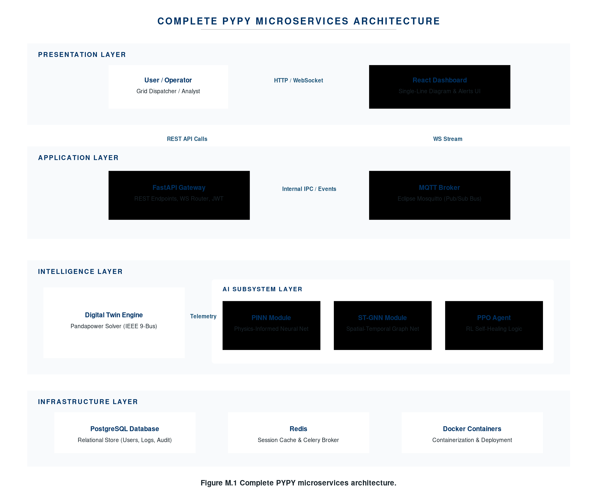

### Mermaid Syntax
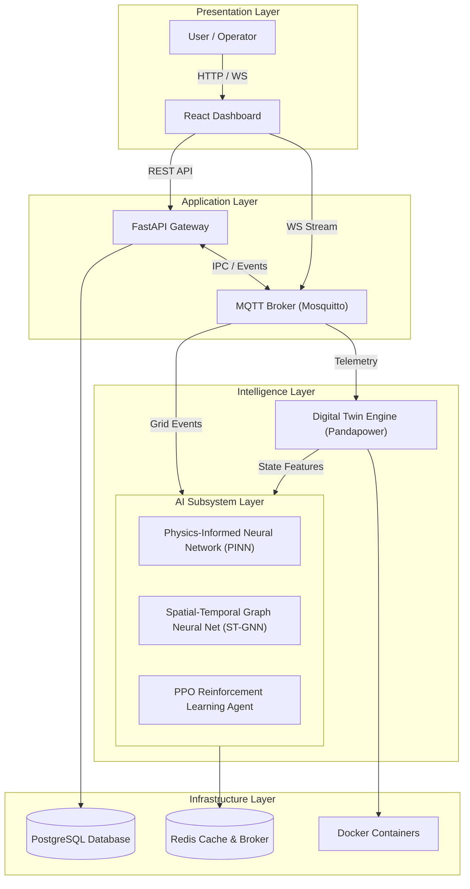

### PlantUML Syntax
```plantuml
@startuml
skinparam backgroundcolor #FFFFFF
skinparam defaultFontName Arial
skinparam RectangleBackgroundColor #FFFFFF
skinparam RectangleBorderColor #003366
skinparam RectangleFontColor #003366
skinparam RectangleFontStyle bold

package "Presentation Layer" {
  [User / Operator] as User
  [React Dashboard] as Dashboard
}

package "Application Layer" {
  [FastAPI Gateway] as Gateway
  [MQTT Broker] as MQTT
}

package "Intelligence Layer" {
  [Digital Twin Engine (Pandapower)] as DigitalTwin
  package "AI Layer" {
    [Physics-Informed Neural Network (PINN)] as PINN
    [Spatial-Temporal Graph Neural Net (ST-GNN)] as STGNN
    [PPO Reinforcement Learning Agent] as PPO
  }
}

package "Infrastructure Layer" {
  database "PostgreSQL Database" as Postgres
  database "Redis" as Redis
  node "Docker Containers" as Docker
}

User --> Dashboard : Interactions
Dashboard --> Gateway : REST API
Dashboard --> MQTT : WS Stream
Gateway <--> MQTT : Event Bus
MQTT --> DigitalTwin : Telemetry
DigitalTwin --> PINN : Features
DigitalTwin --> STGNN : Graph Topo
DigitalTwin --> PPO : State Vector
Gateway --> Postgres : Persistence
PPO --> Redis : Memory State
Intelligence Layer ..> Docker : Container Runtime

caption Figure M.1 Complete PYPY microservices architecture.
@enduml
```

**Files Generated:**
- SVG: [`fig_m1_microservices_architecture.svg`](./fig_m1_microservices_architecture.svg)
- PNG (300 DPI): [`fig_m1_microservices_architecture.png`](./fig_m1_microservices_architecture.png)
- Draw.io: [`fig_m1_microservices_architecture.drawio`](./fig_m1_microservices_architecture.drawio)
- Mermaid: [`fig_m1_microservices_architecture.mmd`](./fig_m1_microservices_architecture.mmd)
- PlantUML: [`fig_m1_microservices_architecture.puml`](./fig_m1_microservices_architecture.puml)

---

## Fig O1 Physics Detection Pipeline

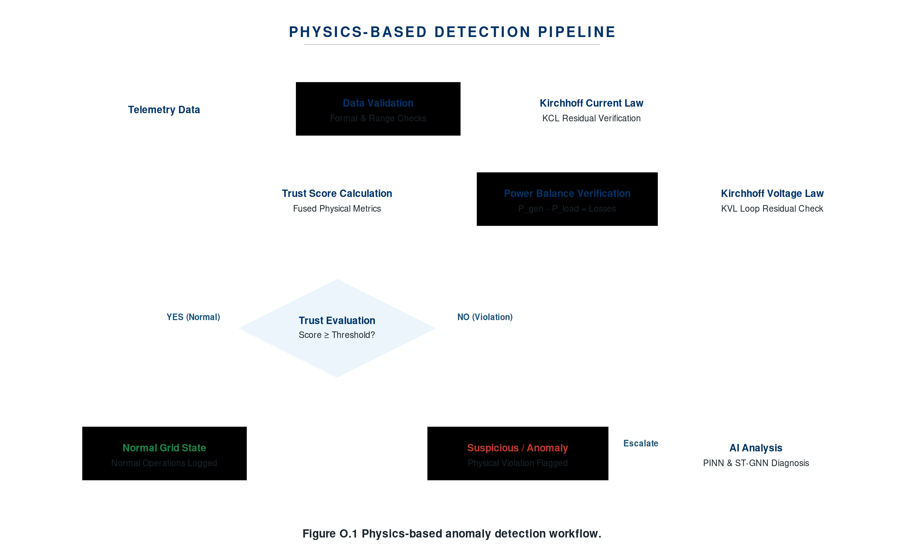

### Mermaid Syntax
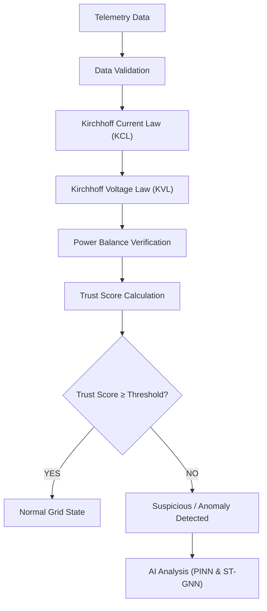

### PlantUML Syntax
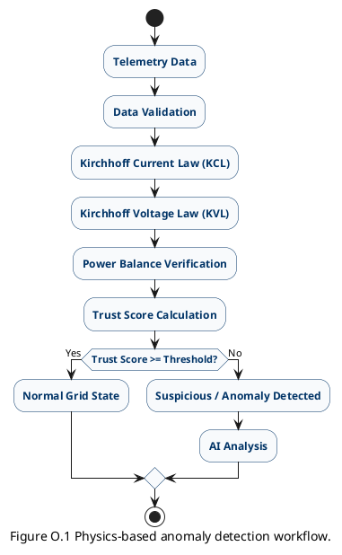

**Files Generated:**
- SVG: [`fig_o1_physics_detection_pipeline.svg`](./fig_o1_physics_detection_pipeline.svg)
- PNG (300 DPI): [`fig_o1_physics_detection_pipeline.png`](./fig_o1_physics_detection_pipeline.png)
- Draw.io: [`fig_o1_physics_detection_pipeline.drawio`](./fig_o1_physics_detection_pipeline.drawio)
- Mermaid: [`fig_o1_physics_detection_pipeline.mmd`](./fig_o1_physics_detection_pipeline.mmd)
- PlantUML: [`fig_o1_physics_detection_pipeline.puml`](./fig_o1_physics_detection_pipeline.puml)

---

## Fig P1 Newton Raphson Solver

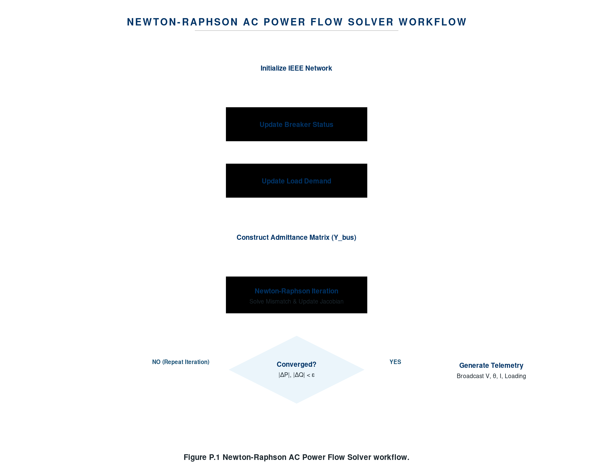

### Mermaid Syntax
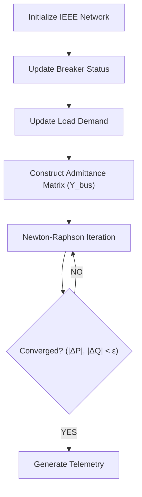

### PlantUML Syntax
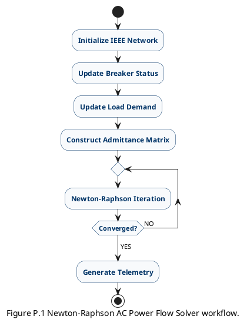

**Files Generated:**
- SVG: [`fig_p1_newton_raphson_solver.svg`](./fig_p1_newton_raphson_solver.svg)
- PNG (300 DPI): [`fig_p1_newton_raphson_solver.png`](./fig_p1_newton_raphson_solver.png)
- Draw.io: [`fig_p1_newton_raphson_solver.drawio`](./fig_p1_newton_raphson_solver.drawio)
- Mermaid: [`fig_p1_newton_raphson_solver.mmd`](./fig_p1_newton_raphson_solver.mmd)
- PlantUML: [`fig_p1_newton_raphson_solver.puml`](./fig_p1_newton_raphson_solver.puml)

---

## Fig P2 Telemetry Streaming

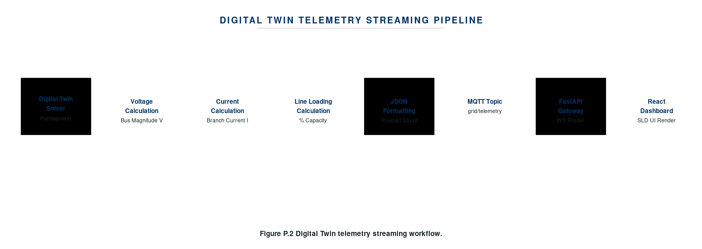

### Mermaid Syntax
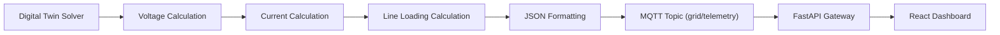

### PlantUML Syntax
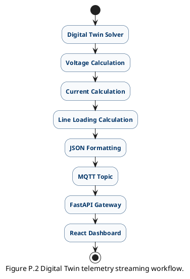

**Files Generated:**
- SVG: [`fig_p2_telemetry_streaming.svg`](./fig_p2_telemetry_streaming.svg)
- PNG (300 DPI): [`fig_p2_telemetry_streaming.png`](./fig_p2_telemetry_streaming.png)
- Draw.io: [`fig_p2_telemetry_streaming.drawio`](./fig_p2_telemetry_streaming.drawio)
- Mermaid: [`fig_p2_telemetry_streaming.mmd`](./fig_p2_telemetry_streaming.mmd)
- PlantUML: [`fig_p2_telemetry_streaming.puml`](./fig_p2_telemetry_streaming.puml)

---

## Fig Q1 Pinn Training Workflow

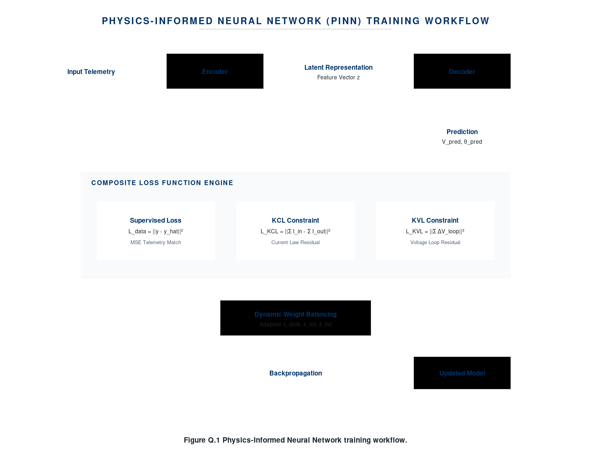

### Mermaid Syntax
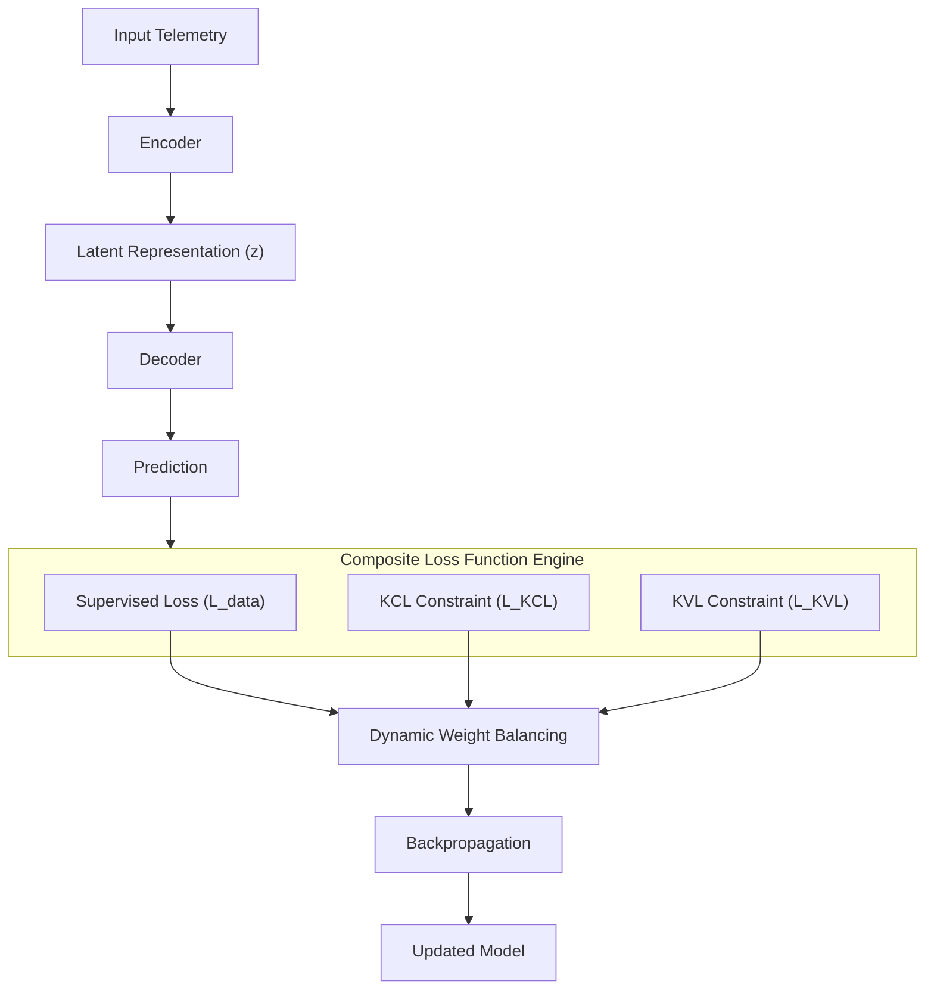

### PlantUML Syntax
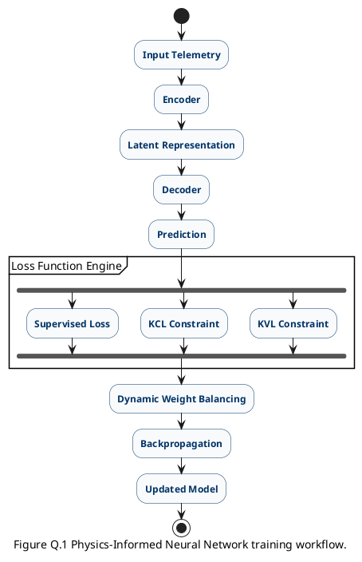

**Files Generated:**
- SVG: [`fig_q1_pinn_training_workflow.svg`](./fig_q1_pinn_training_workflow.svg)
- PNG (300 DPI): [`fig_q1_pinn_training_workflow.png`](./fig_q1_pinn_training_workflow.png)
- Draw.io: [`fig_q1_pinn_training_workflow.drawio`](./fig_q1_pinn_training_workflow.drawio)
- Mermaid: [`fig_q1_pinn_training_workflow.mmd`](./fig_q1_pinn_training_workflow.mmd)
- PlantUML: [`fig_q1_pinn_training_workflow.puml`](./fig_q1_pinn_training_workflow.puml)

---

## Fig R1 Ppo Decision Loop

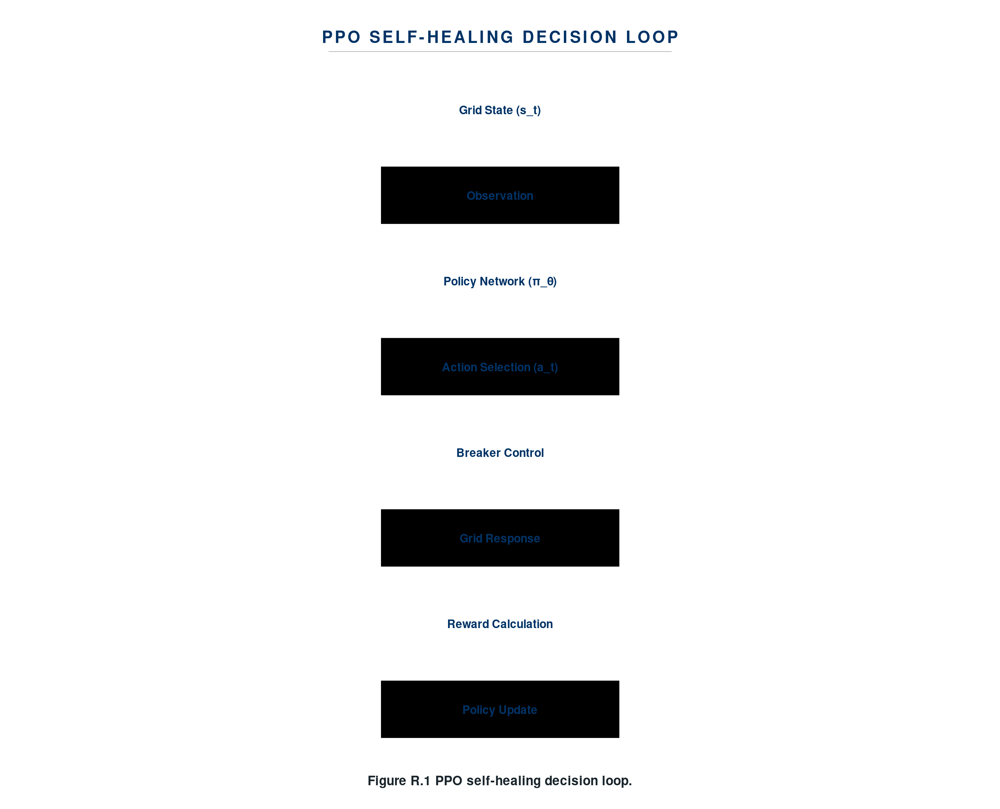

### Mermaid Syntax
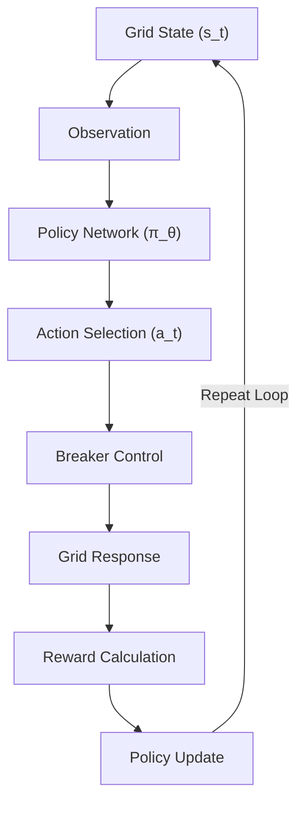

### PlantUML Syntax
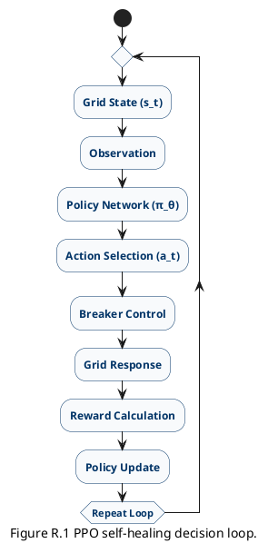

**Files Generated:**
- SVG: [`fig_r1_ppo_decision_loop.svg`](./fig_r1_ppo_decision_loop.svg)
- PNG (300 DPI): [`fig_r1_ppo_decision_loop.png`](./fig_r1_ppo_decision_loop.png)
- Draw.io: [`fig_r1_ppo_decision_loop.drawio`](./fig_r1_ppo_decision_loop.drawio)
- Mermaid: [`fig_r1_ppo_decision_loop.mmd`](./fig_r1_ppo_decision_loop.mmd)
- PlantUML: [`fig_r1_ppo_decision_loop.puml`](./fig_r1_ppo_decision_loop.puml)

---

## Fig S1 Grid Resilience Scoring

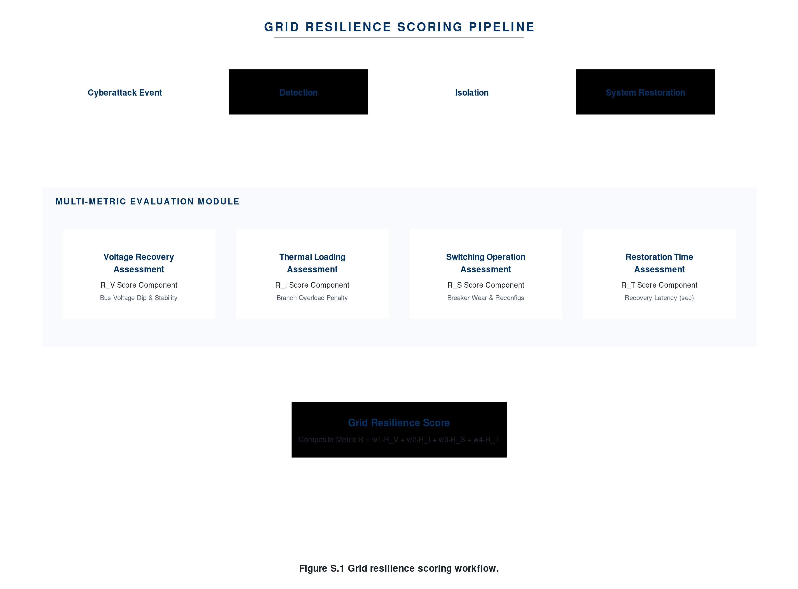

### Mermaid Syntax
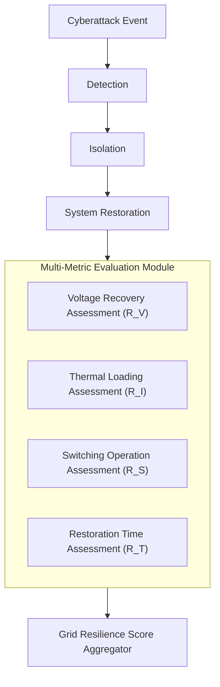

### PlantUML Syntax
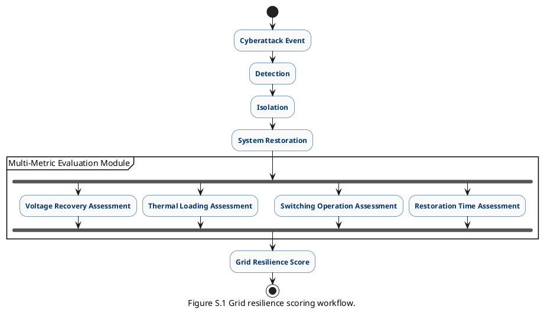

**Files Generated:**
- SVG: [`fig_s1_grid_resilience_scoring.svg`](./fig_s1_grid_resilience_scoring.svg)
- PNG (300 DPI): [`fig_s1_grid_resilience_scoring.png`](./fig_s1_grid_resilience_scoring.png)
- Draw.io: [`fig_s1_grid_resilience_scoring.drawio`](./fig_s1_grid_resilience_scoring.drawio)
- Mermaid: [`fig_s1_grid_resilience_scoring.mmd`](./fig_s1_grid_resilience_scoring.mmd)
- PlantUML: [`fig_s1_grid_resilience_scoring.puml`](./fig_s1_grid_resilience_scoring.puml)

---
